# WYGWYL · Storymap

Built by `lab/matrix/build_storymap.py` from the lab's assets. Every shot is a storyboard prompt (`spine/storyboard.json`) that made a generated image, placed on her clock and set against what the four archive cuts put there. The Save the Cat acts and beats are laid over the clock by proportion; the suite itself is 14 poems.

## How the assets coordinate

| level | source | joined on |
|---|---|---|
| Diegesis | `wygwyl/cuts/suite/matrix_A_patch_genome.yaml`, storyboard characters and settings | the suite |
| Acts, Beats | Save the Cat positions over the 24-minute clock | time on her clock |
| Syntagma (intended) | `syntagmaType` in each storyboard prompt | run of consecutive shots |
| Syntagma (read) | Metz's classifier (`syntagma/metz.js`) on each archive cut | the suite's 88 beats |
| Shot | storyboard record → generated image (`spine/thumbs/`) | `align.py`: storyboard shot → beat |
| Her words | `syntagma/syntagma-data.json` lines | time |
| Archive shots | the four `plan.py` cuts | time |

**Intended against read.** The storyboard intends 41 Chronological Syntagma (CS), 32 Descriptive Syntagma (DS), 6 Flashback Syntagma, 5 Autonomous Syntagma (AS), 4 Thematic Montage (TM). Read by Metz's classifier, the archive cuts give: suite BR 78, AS 9, ALT 1; scenes BR 38, SEQ 35, AS 9, SC 5, EP 1; cineosis BR 79, AS 9; drift BR 79, AS 9. The intended type is realised in 9% of shot-by-cut pairs. Cuts that mix films read as bracket almost everywhere, so a chronological or descriptive intention is carried only where one source film holds the beat (mostly the scenes cut).

**Reading a shot entry** (the Opening Image, SH1, is the worked example below): *Content* is the prompt's scene, *Scene* the storyboard line, *Angle* and *Movement* the camera words the prompt itself uses (blank when it names none), *Duration* the shot's share of its beat on her clock, *Her words* what she says under it, *Image* the generated frame, *In the cuts* the archive shots each cut put there with Metz's reading of that beat, and *Match* how many of the beat title's words the storyboard line shares (0 = placed by order alone).

# Diegesis (D)

**Purpose:** A poem suite read over a continuous score; images are found footage standing in for its situations.

**World rules:**
- one shot per patch, full frame
- no shot repeats
- cuts fall on cue edges and score onsets
- found people are not the poem's characters

**Characters** (named in the storyboard):
- **POET** — in 64 shots, first at SH2
- **EX** — in 16 shots, first at SH2
- **MOTHER** — in 4 shots, first at SH57
- **FATHER** — in 3 shots, first at SH61
- **DJ** — in 1 shots, first at SH44

**Settings** (the descriptive shots that establish a place):
- SH1 · Plain bedroom, high rise, room dim.
- SH4 · TV displays images of world's chaos.
- SH5 · Vape haze blurs vision, EX recedes at window.
- SH13 · Falling amidst chaos and escape images.
- SH17 · POET in black space, falling/floating, lights flashing.
- SH18 · EX in distress, floating unreachable in black space.
- SH19 · Still black, eyes dilate trying to see.
- SH28 · Time-lapse chapel decay, close-ups.
- SH30 · Storm ends, chapel remnants on shore.
- SH32 · POET in Red/Black outfit, sunglasses, on shore at night, hands in pockets.
- SH38 · POET searches for hands in field shadows.
- SH40 · POET enters afro-futuristic ancestors' parade, receives stars, galaxies, universes.
- SH47 · Fast dancing, flashing lights, people enjoying, time shifted.
- SH49 · POET's soul watches party from above Atlantis, city lit blue/pink.
- SH52 · POET stares into mountains from rooftop.
- SH56 · EX and POET stand near phone booth with suitcases.
- SH64 · POET stands alone, inspects motorcycle.
- SH72 · At café, POET observes romantic interests at other tables.
- SH73 · POET observes old couple praying together at church.
- SH74 · Fields of flowers harvested, becoming POET's power.
- SH75 · POET at café, still watching romantic couples.
- SH77 · Haze gathers on water, over harbor, and grows.
- SH78 · Atlantis, new temple, harbor slowly become haze.
- SH80 · POET is floating again in all black.
- … 3 more descriptive shots below

**Title cards and black** (text on screen, not places):
- SH7 · Screen fades to black.
- SH8 · Title card appears.
- SH9 · Title text: WHERE YOU GO WHEN YOU LEAVE.
- SH10 · Subtitle: PART 2 OF 3.
- SH11 · Subtitle: FUTURE.

**Events** (the 14 poems on her clock):
- 01 · OUT OF LIFE (0:00–2:02)
- 02 · FLASHING LIGHTS (2:02–3:34)
- 03 · HOW TO BREAK OFF AN ENGAGEMENT (3:34–4:46)
- 04 · NEVERMORE (4:46–7:01)
- 05 · BLOODLINES (7:02–8:33)
- 06 · RESURRECTING ATLANTIS (8:33–10:23)
- 07 · DJ TURN ME UP (10:23–12:12)
- 08 · NEWLY SINGLE (12:12–13:53)
- 09 · YET, HEARD (13:53–15:50)
- 10 · MAGIC RIDE (15:50–17:36)
- 11 · NEW DAY (17:36–19:28)
- 12 · REUNION (19:28–20:42)
- 13 · HOW TO WIN MY HEART (20:43–22:32)
- 14 · HOT MINUTE (22:32–24:00)

# Act 1 (A1): Setup

**Purpose:** The world before, and the call out of it. On the clock 0:00–5:27, across: OUT OF LIFE, FLASHING LIGHTS, HOW TO BREAK OFF AN ENGAGEMENT, NEVERMORE.

## Opening Image

**Purpose:** A snapshot of the world and the hero before anything changes. Here: SH1–SH3, 0:00–0:19, OUT OF LIFE.

### Syntagma 1 (SY1)
- **Type (intended):** Descriptive Syntagma (DS) [1] · on Metz's table: DESC
- **Purpose:** Mood Environment Stabilizer
- **Read in the cuts:** suite BR · scenes SEQ · cineosis BR · drift BR
- **Intended type realised:** 0% of shot-by-cut pairs

#### Shot 1 (SH1) · WGY001
- **Content:** A dimly lit plain bedroom in a high-rise apartment.
- **Scene:** Plain bedroom, high rise, room dim.
- **Angle:** —
- **Duration:** 5.8 s (0:00–0:05, beat 1 · Dim bedroom; Poet reads to an averted Ex · match 0.4)
- **Movement:** —
- **Function:** Mood Environment Stabilizer · Descriptive Image
- **Her words:** — (instrumental)
- **Image:** 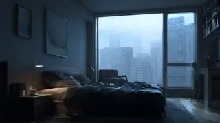
- **Prompt:** `DS · Mood Environment Stabilizer · A dimly lit plain bedroom in a high-rise apartment · Photo-realistic, minimalist bedroom, urban high-rise window, blue-grey dim lighting, subtle dust motes in air.`
- **In the cuts:**
  - suite: BR (shots from 2 films, no time between them: a category) · All My Babies (1953); Volkshuisvesting (1922)
  - scenes: SEQ (one film, moments skipped) · All My Babies (1953); All My Babies (1953)
  - cineosis: BR (shots from 2 films, no time between them: a category) · Sleep for Health (1950); All My Babies (1953)
  - drift: BR (shots from 2 films, no time between them: a category) · Light Of Your Life A (n.d.); [Amateur film: Medicus collection: New York Worl (1939)

### Syntagma 2 (SY2)
- **Type (intended):** Chronological Syntagma (CS) [2–3] · on Metz's table: chronological (SC · SEQ · EP · ALT)
- **Purpose:** Causal Motion Trigger
- **Read in the cuts:** suite BR, AS · scenes SEQ, AS · cineosis BR, AS · drift BR, AS
- **Intended type realised:** 12% of shot-by-cut pairs

#### Shot 2 (SH2) · WGY002
- **Content:** POET, wearing a black t-shirt, reads a poem aloud.
- **Scene:** POET reading poem aloud to EX.
- **Angle:** medium shot
- **Duration:** 5.8 s (0:05–0:11, beat 1 · Dim bedroom; Poet reads to an averted Ex · match 0.4)
- **Movement:** —
- **Function:** Causal Motion Trigger · Action-Image
- **Her words:** — (instrumental)
- **Image:** 
- **Prompt:** `CS · Causal Motion Trigger · POET, wearing a black t-shirt, reads a poem aloud · Photo-realistic, medium shot, soft internal light on POET (black t-shirt), face focused, expressive reading.`
- **In the cuts:**
  - suite: BR (shots from 2 films, no time between them: a category) · All My Babies (1953); Volkshuisvesting (1922)
  - scenes: SEQ (one film, moments skipped) · All My Babies (1953); All My Babies (1953)
  - cineosis: BR (shots from 2 films, no time between them: a category) · Sleep for Health (1950); All My Babies (1953)
  - drift: BR (shots from 2 films, no time between them: a category) · Light Of Your Life A (n.d.); [Amateur film: Medicus collection: New York Worl (1939)

#### Shot 3 (SH3) · WGY003
- **Content:** EX, back turned, vapes on a fire escape outside a bedroom window.
- **Scene:** EX on fire escape, vaping, back to camera.
- **Angle:** wide shot, back to camera
- **Duration:** 7.7 s (0:11–0:19, beat 2 · Ex on the fire escape · match 1.0)
- **Movement:** —
- **Function:** Causal Motion Trigger · Action-Image
- **Her words:** — (instrumental)
- **Image:** 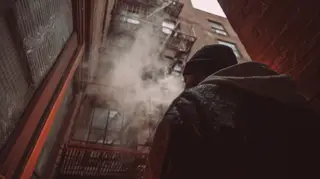
- **Prompt:** `CS · Causal Motion Trigger · EX, back turned, vapes on a fire escape outside a bedroom window · Photo-realistic, wide shot, EX (back to camera, never showing face), vape cloud, gritty fire escape, high-rise window frame, urban backdrop.`
- **In the cuts:**
  - suite: AS (one shot holds the whole slot) · Volkshuisvesting (1922)
  - scenes: AS (one shot holds the whole slot) · All My Babies (1953)
  - cineosis: AS (one shot holds the whole slot) · All My Babies (1953)
  - drift: AS (one shot holds the whole slot) · [Amateur film: Medicus collection: New York Worl (1939)

## Set-Up

**Purpose:** The hero's world, what is missing from it, and what is at stake. Here: SH4–SH20, 0:19–2:43, OUT OF LIFE, FLASHING LIGHTS.

### Syntagma 3 (SY3)
- **Type (intended):** Descriptive Syntagma (DS) [4–5] · on Metz's table: DESC
- **Purpose:** Subjective Frame Recalibration
- **Read in the cuts:** suite AS, BR · scenes AS, SEQ · cineosis AS, BR · drift AS, BR
- **Intended type realised:** 0% of shot-by-cut pairs

#### Shot 4 (SH4) · WGY004
- **Content:** A television screen cycles through rapid, chaotic world events.
- **Scene:** TV displays images of world's chaos.
- **Angle:** close-up
- **Duration:** 7.7 s (0:19–0:26, beat 3 · Television showing world chaos · match 0.75)
- **Movement:** —
- **Function:** Subjective Frame Recalibration · Perception-Image
- **Her words:** — (instrumental)
- **Image:** 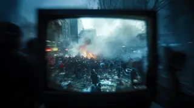
- **Prompt:** `PI · Subjective Frame Recalibration · A television screen cycles through rapid, chaotic world events · Photo-realistic, close-up on TV screen, montage of war, protests, natural disasters, flickering chaotic imagery, desaturated tones.`
- **In the cuts:**
  - suite: AS (one shot holds the whole slot) · Hillsborough with New Hideaway Styling, The (1959)
  - scenes: AS (one shot holds the whole slot) · All My Babies (1953)
  - cineosis: AS (one shot holds the whole slot) · THE PHOTOGRAPHER (1948)
  - drift: AS (one shot holds the whole slot) · Moonwalk One, ca. 1970 (1970)

#### Shot 5 (SH5) · WGY005
- **Content:** Dense vape haze engulfs the room, blurring vision as EX appears to recede further away through the window.
- **Scene:** Vape haze blurs vision, EX recedes at window.
- **Angle:** pov, silhouette
- **Duration:** 11.5 s (0:34–0:46, beat 5 · Window approaches while Ex recedes · match 0.5)
- **Movement:** —
- **Function:** Subjective Frame Recalibration · Perception-Image
- **Her words:** “What we've made we don't want, what we've sold to the world, to ourselves, doesn't exist. / I look for a way out through the hallways, within the drawers and fire escapes, trip / on my own words, falling out of life, and find where you go when you leave.”
- **Image:** 
- **Prompt:** `PI · Subjective Frame Recalibration · Dense vape haze engulfs the room, blurring vision as EX appears to recede further away through the window · Photo-realistic, subjective POV, increasing diffusion filter, ethereal blue-grey vape cloud, EX becoming indistinct silhouette, sense of entrapment.`
- **In the cuts:**
  - suite: BR (shots from 2 films, no time between them: a category) · Moonwalk One, ca. 1970 (1970); JFK EXHIBIT 3: RECONSTRUCTION FILM (1943)
  - scenes: SEQ (one film, moments skipped) · JFK EXHIBIT 3: RECONSTRUCTION FILM (1943); JFK EXHIBIT 3: RECONSTRUCTION FILM (1943)
  - cineosis: BR (shots from 2 films, no time between them: a category) · Robinson Crusoe C (1927); Broadway Limited (1941)
  - drift: BR (shots from 2 films, no time between them: a category) · Apollo 12: Pinpoint for Science (1969); Ripley's Believe it or Not Museum - Gatlinburg,  (2007)

### Syntagma 4 (SY4)
- **Type (intended):** Chronological Syntagma (CS) [6] · on Metz's table: chronological (SC · SEQ · EP · ALT)
- **Purpose:** Causal Motion Trigger
- **Read in the cuts:** suite BR · scenes BR · cineosis BR · drift BR
- **Intended type realised:** 0% of shot-by-cut pairs

#### Shot 6 (SH6) · WGY006
- **Content:** EX tumbles from the fire escape into an inky abyss, followed by POET descending into dense, darkening clouds.
- **Scene:** EX falls from fire escape into darkness, POET follows into black clouds.
- **Angle:** —
- **Duration:** 11.5 s (0:46–0:57, beat 6 · Ex falls, Poet follows into clouds · match 1.0)
- **Movement:** dynamic, falling, descending
- **Function:** Causal Motion Trigger · Action-Image
- **Her words:** “on my own words, falling out of life, and find where you go when you leave. / It was the maze constructed by a tainted love, a known yet unknown pit beneath the quicksands / of the make-believe haven, and hidden in the overnourished forest of escapism that calls”
- **Image:** 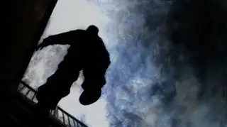
- **Prompt:** `CS · Causal Motion Trigger · EX tumbles from the fire escape into an inky abyss, followed by POET descending into dense, darkening clouds · Photo-realistic, dynamic shot, figures falling, deep shadows, swirling black clouds, sense of vertigo and endless descent, abstract darkness.`
- **In the cuts:**
  - suite: BR (shots from 2 films, no time between them: a category) · Duck and Cover (1951); Lens, Hollands dorp in Frankrijk (1921)
  - scenes: BR (shots from 2 films, no time between them: a category) · JFK EXHIBIT 3: RECONSTRUCTION FILM (1943); The Green Promise (1949)
  - cineosis: BR (shots from 2 films, no time between them: a category) · Looking Ahead Through Plexiglas A (n.d.); Master Hands (n.d.)
  - drift: BR (shots from 2 films, no time between them: a category) · Rochester: A City of Quality (Part I) (1963); Moonwalk One, ca. 1970 (1970)

### Syntagma 5 (SY5)
- **Type (intended):** Descriptive Syntagma (DS) [7–11] · on Metz's table: DESC
- **Purpose:** Mood Environment Stabilizer
- **Read in the cuts:** suite AS×3, BR×2 · scenes AS×3, SEQ, BR · cineosis AS×3, BR×2 · drift AS×3, BR×2
- **Intended type realised:** 0% of shot-by-cut pairs

#### Shot 7 (SH7) · WGY007
- **Content:** A complete blackout of the screen.
- **Scene:** Screen fades to black.
- **Angle:** —
- **Duration:** 1.3 s (0:57–0:58, beat 7 · Black and title card · match 0.33)
- **Movement:** —
- **Function:** Mood Environment Stabilizer · Descriptive Image
- **Her words:** “of the make-believe haven, and hidden in the overnourished forest of escapism that calls”
- **Image:** 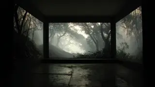
- **Prompt:** `DS · Mood Environment Stabilizer · A complete blackout of the screen · Pure black screen, silent transition.`
- **In the cuts:**
  - suite: AS (one shot holds the whole slot) · Lens, Hollands dorp in Frankrijk (1921)
  - scenes: AS (one shot holds the whole slot) · The Green Promise (1949)
  - cineosis: AS (one shot holds the whole slot) · Master Hands (n.d.)
  - drift: AS (one shot holds the whole slot) · Moonwalk One, ca. 1970 (1970)

#### Shot 8 (SH8) · WGY008
- **Content:** A title card appears on screen.
- **Scene:** Title card appears.
- **Angle:** —
- **Duration:** 1.3 s (0:58–1:00, beat 7 · Black and title card · match 0.67)
- **Movement:** —
- **Function:** Mood Environment Stabilizer · Descriptive Image
- **Her words:** “of the make-believe haven, and hidden in the overnourished forest of escapism that calls”
- **Image:** 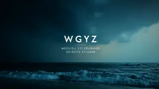
- **Prompt:** `DS · Mood Environment Stabilizer · A title card appears on screen · Stylized typography, clean, minimalist background for title card.`
- **In the cuts:**
  - suite: AS (one shot holds the whole slot) · Lens, Hollands dorp in Frankrijk (1921)
  - scenes: AS (one shot holds the whole slot) · The Green Promise (1949)
  - cineosis: AS (one shot holds the whole slot) · Master Hands (n.d.)
  - drift: AS (one shot holds the whole slot) · Moonwalk One, ca. 1970 (1970)

#### Shot 9 (SH9) · WGY009
- **Content:** The main title 'WHERE YOU GO WHEN YOU LEAVE' displayed.
- **Scene:** Title text: WHERE YOU GO WHEN YOU LEAVE.
- **Angle:** —
- **Duration:** 1.3 s (1:00–1:01, beat 7 · Black and title card · match 0.33)
- **Movement:** —
- **Function:** Mood Environment Stabilizer · Descriptive Image
- **Her words:** “of the make-believe haven, and hidden in the overnourished forest of escapism that calls”
- **Image:** 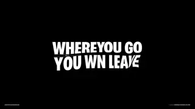
- **Prompt:** `DS · Mood Environment Stabilizer · The main title 'WHERE YOU GO WHEN YOU LEAVE' displayed · White sans-serif text on black background, crisp typography.`
- **In the cuts:**
  - suite: AS (one shot holds the whole slot) · Lens, Hollands dorp in Frankrijk (1921)
  - scenes: AS (one shot holds the whole slot) · The Green Promise (1949)
  - cineosis: AS (one shot holds the whole slot) · Master Hands (n.d.)
  - drift: AS (one shot holds the whole slot) · Moonwalk One, ca. 1970 (1970)

#### Shot 10 (SH10) · WGY010
- **Content:** Subtitle 'PART 2 OF 3' displayed below the main title.
- **Scene:** Subtitle: PART 2 OF 3.
- **Angle:** —
- **Duration:** 7.7 s (1:01–1:09, beat 8 · World chaos interrupts the fall · match 0.0)
- **Movement:** —
- **Function:** Mood Environment Stabilizer · Descriptive Image
- **Her words:** “of the make-believe haven, and hidden in the overnourished forest of escapism that calls / for you. / At this age, I'll follow, following the full distance between us almost having it all and”
- **Image:** 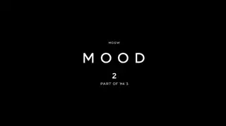
- **Prompt:** `DS · Mood Environment Stabilizer · Subtitle 'PART 2 OF 3' displayed below the main title · Smaller white sans-serif text on black background, aligned below main title.`
- **In the cuts:**
  - suite: BR (shots from 2 films, no time between them: a category) · Lens, Hollands dorp in Frankrijk (1921); Master Hands (n.d.)
  - scenes: SEQ (one film, source order unknown) · The Green Promise (1949); The Green Promise (1949)
  - cineosis: BR (shots from 2 films, no time between them: a category) · Master Hands (n.d.); Onze eigen industrie: kreeftenvangst (1923)
  - drift: BR (shots from 2 films, no time between them: a category) · Moonwalk One, ca. 1970 (1970); [Amateur film: Medicus collection: New York Worl (1939)

#### Shot 11 (SH11) · WGY011
- **Content:** Subtitle 'FUTURE' displayed below the section title.
- **Scene:** Subtitle: FUTURE.
- **Angle:** —
- **Duration:** 7.7 s (1:09–1:16, beat 9 · Escapism: drugs and intoxication · match 0.0)
- **Movement:** —
- **Function:** Mood Environment Stabilizer · Descriptive Image
- **Her words:** “At this age, I'll follow, following the full distance between us almost having it all and / starting anew, to rediscover when love was real. / I failed at protecting you from your own vices, crashing the party of your evilest instincts”
- **Image:** 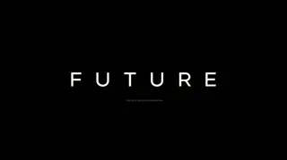
- **Prompt:** `DS · Mood Environment Stabilizer · Subtitle 'FUTURE' displayed below the section title · Smaller white sans-serif text on black background, aligned below section title.`
- **In the cuts:**
  - suite: BR (shots from 2 films, no time between them: a category) · Master Hands (n.d.); De Joodsche invalide (1939)
  - scenes: BR (shots from 2 films, no time between them: a category) · The Green Promise (1949); Moonwalk One, ca. 1970 (1970)
  - cineosis: BR (shots from 2 films, no time between them: a category) · Onze eigen industrie: kreeftenvangst (1923); Berlin: Symphony of a Great City (n.d.)
  - drift: BR (shots from 2 films, no time between them: a category) · [Amateur film: Medicus collection: New York Worl (1939); Harvest Of The Years (n.d.)

### Syntagma 6 (SY6)
- **Type (intended):** Chronological Syntagma (CS) [12] · on Metz's table: chronological (SC · SEQ · EP · ALT)
- **Purpose:** Causal Motion Trigger
- **Read in the cuts:** suite BR · scenes SEQ · cineosis BR · drift BR
- **Intended type realised:** 25% of shot-by-cut pairs

#### Shot 12 (SH12) · WGY012
- **Content:** POET continues to fall, slightly behind EX, whose face remains hidden.
- **Scene:** POET falling behind EX, EX's face unseen.
- **Angle:** silhouette
- **Duration:** 7.7 s (1:16–1:24, beat 10 · Escapism: party, television and phone · match 0.0)
- **Movement:** dynamic, falling
- **Function:** Causal Motion Trigger · Action-Image
- **Her words:** “I failed at protecting you from your own vices, crashing the party of your evilest instincts / to find vibrations that echo in silence, love and hate languages that translate and slow”
- **Image:** 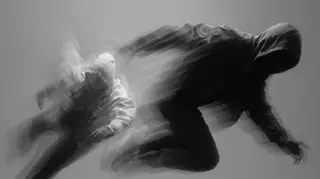
- **Prompt:** `CS · Causal Motion Trigger · POET continues to fall, slightly behind EX, whose face remains hidden · Photo-realistic, dynamic shot, two figures falling through abstract space, depth of field separating them, EX as a distinct but faceless silhouette, continuous motion.`
- **In the cuts:**
  - suite: BR (shots from 2 films, no time between them: a category) · De Joodsche invalide (1939); All My Babies (1953)
  - scenes: SEQ (one film, source order unknown) · Moonwalk One, ca. 1970 (1970); Moonwalk One, ca. 1970 (1970)
  - cineosis: BR (shots from 2 films, no time between them: a category) · Berlin: Symphony of a Great City (n.d.); Muller en co n.v. Rotterdam (1928)
  - drift: BR (shots from 2 films, no time between them: a category) · Harvest Of The Years (n.d.); Master Hands (n.d.)

### Syntagma 7 (SY7)
- **Type (intended):** Descriptive Syntagma (DS) [13] · on Metz's table: DESC
- **Purpose:** Narrative Modifier
- **Read in the cuts:** suite BR · scenes BR · cineosis BR · drift BR
- **Intended type realised:** 0% of shot-by-cut pairs

#### Shot 13 (SH13) · WGY013
- **Content:** Figures fall through a shifting montage of world chaos and various forms of escape (drugs, partying, media, phone use).
- **Scene:** Falling amidst chaos and escape images.
- **Angle:** —
- **Duration:** 11.5 s (1:24–1:36, beat 11 · Crash into the vintage party · match 0.0)
- **Movement:** —
- **Function:** Narrative Modifier · Thematic Montage
- **Her words:** “to find vibrations that echo in silence, love and hate languages that translate and slow / dripping blood salivating on imminent doubts, fully awakening to our darkest nights. / Pause for a second, a spectrum of fields will thread needles of garments made of sweet memories”
- **Image:** 
- **Prompt:** `TM · Narrative Modifier · Figures fall through a shifting montage of world chaos and various forms of escape (drugs, partying, media, phone use) · Photo-realistic, surreal montage, rapid cuts or dissolves between chaotic and escapist imagery (vibrant, blurred, flickering), figures remain central, disorienting visual flow.`
- **In the cuts:**
  - suite: BR (shots from 2 films, no time between them: a category) · All My Babies (1953); Children Must Learn, The (1940)
  - scenes: BR (shots from 2 films, no time between them: a category) · Moonwalk One, ca. 1970 (1970); All My Babies (1953)
  - cineosis: BR (shots from 2 films, no time between them: a category) · Muller en co n.v. Rotterdam (1928); All My Babies (1953)
  - drift: BR (shots from 2 films, no time between them: a category) · Master Hands (n.d.); ALASKAN EARTHQUAKE (1966)

### Syntagma 8 (SY8)
- **Type (intended):** Chronological Syntagma (CS) [14–16] · on Metz's table: chronological (SC · SEQ · EP · ALT)
- **Purpose:** Causal Motion Trigger
- **Read in the cuts:** suite BR×2, AS · scenes SC, BR, AS · cineosis BR×2, AS · drift BR×2, AS
- **Intended type realised:** 8% of shot-by-cut pairs

#### Shot 14 (SH14) · WGY014
- **Content:** POET abruptly enters an old-time vintage party where guests move in romantic slow-motion, illuminated by euphoric light leaks.
- **Scene:** POET crashes into vintage party, slow-motion guests, euphoric light.
- **Angle:** —
- **Duration:** 7.7 s (1:36–1:43, beat 12 · Romantic slow motion and light leaks · match 1.0)
- **Movement:** —
- **Function:** Causal Motion Trigger · Action-Image
- **Her words:** “Pause for a second, a spectrum of fields will thread needles of garments made of sweet memories / and photographs, film and fiction that leave me empty.”
- **Image:** 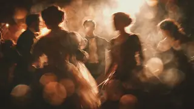
- **Prompt:** `CS · Causal Motion Trigger · POET abruptly enters an old-time vintage party where guests move in romantic slow-motion, illuminated by euphoric light leaks · Photo-realistic, dreamlike, soft focus, warm sepia and gold tones, glowing lens flares, ethereal light, period costumes, slow-motion figures.`
- **In the cuts:**
  - suite: BR (shots from 2 films, no time between them: a category) · Children Must Learn, The (1940); Vrijheidsbond, feest in dierentuin (1922)
  - scenes: SC (one film, no time skipped) · All My Babies (1953); All My Babies (1953)
  - cineosis: BR (shots from 2 films, no time between them: a category) · All My Babies (1953); Back-Room Boy (1942)
  - drift: BR (shots from 2 films, no time between them: a category) · ALASKAN EARTHQUAKE (1966); Fashion's Favorite (Part I) (1940)

#### Shot 15 (SH15) · WGY015
- **Content:** POET pursues EX (whose face is never seen) through the dense party crowd, but EX repeatedly vanishes and reappears.
- **Scene:** POET chases vanishing EX through party crowd.
- **Angle:** —
- **Duration:** 7.7 s (1:43–1:51, beat 13 · Chase Ex through the crowd · match 1.0)
- **Movement:** dynamic
- **Function:** Causal Motion Trigger · Action-Image
- **Her words:** “and photographs, film and fiction that leave me empty. / With your back faced against me, you offer me a new pursuit of happiness as I stumble / on my own words, landing into the secret of where you go when you leave, and I fall”
- **Image:** 
- **Prompt:** `CS · Causal Motion Trigger · POET pursues EX (whose face is never seen) through the dense party crowd, but EX repeatedly vanishes and reappears · Photo-realistic, dynamic chase, motion blur on crowd, EX appearing as a fleeting, elusive figure, POET's determined expression, shifting light.`
- **In the cuts:**
  - suite: BR (shots from 2 films, no time between them: a category) · Vrijheidsbond, feest in dierentuin (1922); Duck and Cover (1951)
  - scenes: BR (shots from 2 films, no time between them: a category) · All My Babies (1953); Adelante Cubanos (Part I) (1959)
  - cineosis: BR (shots from 2 films, no time between them: a category) · Back-Room Boy (1942); Years of Grandeur: Alexander Hamilton U.S. Custo (2007)
  - drift: BR (shots from 2 films, no time between them: a category) · Fashion's Favorite (Part I) (1940); Valley Town (1940)

#### Shot 16 (SH16) · WGY016
- **Content:** POET stumbles through a sudden hole in the floor, descending once again into absolute darkness.
- **Scene:** POET trips through floor hole, falls into pure blackness.
- **Angle:** —
- **Duration:** 3.8 s (1:59–2:02, beat 15 · Floor opens; Poet falls into black · match 0.6)
- **Movement:** descending
- **Function:** Causal Motion Trigger · Action-Image
- **Her words:** — (instrumental)
- **Image:** 
- **Prompt:** `CS · Causal Motion Trigger · POET stumbles through a sudden hole in the floor, descending once again into absolute darkness · Photo-realistic, sudden cut from vibrant party to abrupt fall, transition to deep black void, sense of disorientation.`
- **In the cuts:**
  - suite: AS (one shot holds the whole slot) · All My Babies (1953)
  - scenes: AS (one shot holds the whole slot) · Adelante Cubanos (Part I) (1959)
  - cineosis: AS (one shot holds the whole slot) · Laboratory Design for Microbiological Safety (1966)
  - drift: AS (one shot holds the whole slot) · River, The (Part I) (1937)

### Syntagma 9 (SY9)
- **Type (intended):** Descriptive Syntagma (DS) [17–19] · on Metz's table: DESC
- **Purpose:** Subjective Frame Recalibration; Emotion Relay
- **Read in the cuts:** suite BR×3 · scenes BR×2, SEQ · cineosis BR×3 · drift BR×3
- **Intended type realised:** 0% of shot-by-cut pairs

#### Shot 17 (SH17) · WGY017
- **Content:** POET is suspended in a black void, either falling or floating, as intermittent lights flash around.
- **Scene:** POET in black space, falling/floating, lights flashing.
- **Angle:** silhouette
- **Duration:** 13.7 s (2:02–2:16, beat 16 · Poet floats in black under flashes · match 0.4)
- **Movement:** floating, falling
- **Function:** Subjective Frame Recalibration · Perception-Image
- **Her words:** “I heard a scream for help while falling with my headlights off. / It was a type of silent scream a trap lover makes to escape a pending marriage,”
- **Image:** 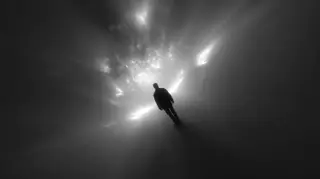
- **Prompt:** `PI · Subjective Frame Recalibration · POET is suspended in a black void, either falling or floating, as intermittent lights flash around · Photo-realistic, abstract black space, contrasting sharp white or colored light flashes, POET's figure as a silhouette or dimly lit form, disorienting perspective.`
- **In the cuts:**
  - suite: BR (shots from 2 films, no time between them: a category) · NASA Searches for Life from the Moon in Recently (1969); Master Hands (n.d.)
  - scenes: SEQ (one film, source order unknown) · Wording standbeeld van stadhouder Willem III (1921); Wording standbeeld van stadhouder Willem III (1921)
  - cineosis: BR (shots from 2 films, no time between them: a category) · Cataloochee - The Center of the World (1993); Knights on the Highway (1938)
  - drift: BR (shots from 2 films, no time between them: a category) · The Green Promise (1949); San Francisco Earthquake Aftermath, Part 1 (1906)

#### Shot 18 (SH18) · WGY018
- **Content:** EX, in apparent distress, floats nearby but remains unreachable in the black void.
- **Scene:** EX in distress, floating unreachable in black space.
- **Angle:** silhouette
- **Duration:** 9.1 s (2:16–2:25, beat 17 · Unreachable Ex in distress · match 1.0)
- **Movement:** —
- **Function:** Emotion Relay · Affection-Image
- **Her words:** “It was a type of silent scream a trap lover makes to escape a pending marriage, / a concussion, a set of walls caving inward, seething and simmering, / and a solitude of crowds and smiles.”
- **Image:** 
- **Prompt:** `AF · Emotion Relay · EX, in apparent distress, floats nearby but remains unreachable in the black void · Photo-realistic, same black space, EX's silhouette or form conveying distress, emphasis on distance and separation, subtle light to highlight unreachability.`
- **In the cuts:**
  - suite: BR (shots from 2 films, no time between them: a category) · Master Hands (n.d.); Moonwalk One, ca. 1970 (1970)
  - scenes: BR (shots from 2 films, no time between them: a category) · Wording standbeeld van stadhouder Willem III (1921); Moonwalk One, ca. 1970 (1970)
  - cineosis: BR (shots from 2 films, no time between them: a category) · Knights on the Highway (1938); Moonwalk One, ca. 1970 (1970)
  - drift: BR (shots from 2 films, no time between them: a category) · San Francisco Earthquake Aftermath, Part 1 (1906); National Archives Building (1937)

#### Shot 19 (SH19) · WGY019
- **Content:** The screen remains profoundly black, mimicking eyes dilating to perceive light within absolute darkness.
- **Scene:** Still black, eyes dilate trying to see.
- **Angle:** —
- **Duration:** 9.1 s (2:25–2:34, beat 18 · Dilating eyes in darkness · match 1.0)
- **Movement:** —
- **Function:** Subjective Frame Recalibration · Perception-Image
- **Her words:** “and a solitude of crowds and smiles. / I received an emergency call while tossing and turning. / It was a type of silent call a man makes to the mirror after midnight.”
- **Image:** 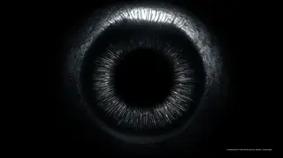
- **Prompt:** `PI · Subjective Frame Recalibration · The screen remains profoundly black, mimicking eyes dilating to perceive light within absolute darkness · Pure black screen, subtle digital effect of iris dilation, faint, almost imperceptible shifts in black levels.`
- **In the cuts:**
  - suite: BR (shots from 2 films, no time between them: a category) · Moonwalk One, ca. 1970 (1970); Singing Wheels (n.d.)
  - scenes: BR (shots from 2 films, no time between them: a category) · Moonwalk One, ca. 1970 (1970); Who's Out There? (1975)
  - cineosis: BR (shots from 2 films, no time between them: a category) · Moonwalk One, ca. 1970 (1970); ABCs of Walking Wisely (1959)
  - drift: BR (shots from 2 films, no time between them: a category) · National Archives Building (1937); Plastics (1944)

### Syntagma 10 (SY10)
- **Type (intended):** Flashback Syntagma [20] · on Metz's table: not in Metz's table (an insert or alternate flashback)
- **Purpose:** Memory Storage Retrieval
- **Read in the cuts:** suite BR · scenes BR · cineosis BR · drift BR
- **Intended type realised:** 0% of shot-by-cut pairs

#### Shot 20 (SH20) · WGY020
- **Content:** The camera pushes into and through dilated eyes, transitioning into a flashback.
- **Scene:** Into eyes, through eyes, entering flashback.
- **Angle:** —
- **Duration:** 9.1 s (2:34–2:43, beat 19 · Enter childhood through the eye · match 0.5)
- **Movement:** zoom
- **Function:** Memory Storage Retrieval · Recollection-Image
- **Her words:** “It was a type of silent call a man makes to the mirror after midnight. / To digest the truth, a windless insomnia and epiphany of a road winding down.”
- **Image:** 
- **Prompt:** `RI · Memory Storage Retrieval · The camera pushes into and through dilated eyes, transitioning into a flashback · Abstract transition, rapid zoom into a pupil, visual distortions, sudden shift in tone and setting, classic flashback cues.`
- **In the cuts:**
  - suite: BR (shots from 2 films, no time between them: a category) · Singing Wheels (n.d.); All My Babies (1953)
  - scenes: BR (shots from 2 films, no time between them: a category) · Who's Out There? (1975); SPACE AGE RAILROAD (1969)
  - cineosis: BR (shots from 2 films, no time between them: a category) · ABCs of Walking Wisely (1959); Scrooge (1935)
  - drift: BR (shots from 2 films, no time between them: a category) · Plastics (1944); Knights on the Highway (1938)

## Catalyst

**Purpose:** The event that knocks the hero's world off its axis. Here: SH21–SH21, 2:43–2:53, FLASHING LIGHTS.

### Syntagma 11 (SY11)
- **Type (intended):** Flashback Syntagma [21] · on Metz's table: not in Metz's table (an insert or alternate flashback)
- **Purpose:** Memory Storage Retrieval
- **Read in the cuts:** suite BR · scenes SEQ · cineosis BR · drift BR
- **Intended type realised:** 0% of shot-by-cut pairs

#### Shot 21 (SH21) · WGY021
- **Content:** A young POET watches from a living room window as a car pulls up, its lights flashing erratically through the room due to road bumps and light angles.
- **Scene:** Young POET at window, car pulls up, flashing lights.
- **Angle:** —
- **Duration:** 9.1 s (2:43–2:53, beat 20 · Young Poet watches headlights sweep the room · match 0.67)
- **Movement:** —
- **Function:** Memory Storage Retrieval · Recollection-Image
- **Her words:** “After a day of life dilated at the sun as long and as wise as possible, we won't make it.”
- **Image:** 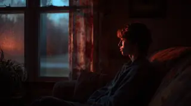
- **Prompt:** `RI · Memory Storage Retrieval · A young POET watches from a living room window as a car pulls up, its lights flashing erratically through the room due to road bumps and light angles · Photo-realistic, nostalgic, dimly lit living room, warm and cool light contrast from outside, rapid flickering light effects, young POET's innocent expression.`
- **In the cuts:**
  - suite: BR (shots from 2 films, no time between them: a category) · All My Babies (1953); Don't Talk to Strangers (n.d.)
  - scenes: SEQ (one film, moments skipped) · SPACE AGE RAILROAD (1969); SPACE AGE RAILROAD (1969)
  - cineosis: BR (shots from 2 films, no time between them: a category) · Scrooge (1935); All My Babies (1953)
  - drift: BR (shots from 2 films, no time between them: a category) · Knights on the Highway (1938); APOLLO 16MM ONBOARD SELECT VIEWS FROM HDTV TRANS (2006)

## Debate

**Purpose:** The hero resists or doubts the call. Here: SH22–SH34, 3:06–5:20, FLASHING LIGHTS, HOW TO BREAK OFF AN ENGAGEMENT, NEVERMORE.

### Syntagma 12 (SY12)
- **Type (intended):** Autonomous Syntagma (AS) [22] · on Metz's table: AS
- **Purpose:** Emotion Relay
- **Read in the cuts:** suite BR · scenes BR · cineosis BR · drift BR
- **Intended type realised:** 0% of shot-by-cut pairs

#### Shot 22 (SH22) · WGY022
- **Content:** A translucent 'ghost kid' appears and embraces the young POET.
- **Scene:** Ghost kid appears, hugs Young POET.
- **Angle:** —
- **Duration:** 6.8 s (3:06–3:13, beat 22 · Ghost child appears, embraces Poet · match 0.8)
- **Movement:** —
- **Function:** Emotion Relay · Affection-Image
- **Her words:** “It was a type of warm and heavy breeze in winter / where a child is left home alone. / With curtains pulled and blinds up as far and as wise as possible to see flashing lights”
- **Image:** 
- **Prompt:** `AF · Emotion Relay · A translucent 'ghost kid' appears and embraces the young POET · Photo-realistic, ethereal, soft glow for the ghost child, tender interaction, slight blur or distortion for the ghost, emotional warmth.`
- **In the cuts:**
  - suite: BR (shots from 2 films, no time between them: a category) · Moonwalk One, ca. 1970 (1970); Alice In Wonderland (1915)
  - scenes: BR (shots from 2 films, no time between them: a category) · AUTOMOBILE ECONOMY TEST, ca. 1938 (n.d.); NASA Searches for Life from the Moon in Recently (1969)
  - cineosis: BR (shots from 2 films, no time between them: a category) · De Joodsche invalide (1939); Kinderen naar buiten (1935)
  - drift: BR (shots from 2 films, no time between them: a category) · Ripley's Believe it or Not Museum - Gatlinburg,  (2007); Apollo 12: Pinpoint for Science (1969)

### Syntagma 13 (SY13)
- **Type (intended):** Flashback Syntagma [23] · on Metz's table: not in Metz's table (an insert or alternate flashback)
- **Purpose:** Memory Storage Retrieval
- **Read in the cuts:** suite BR · scenes BR · cineosis BR · drift BR
- **Intended type realised:** 0% of shot-by-cut pairs

#### Shot 23 (SH23) · WGY023
- **Content:** The ghost child vanishes, leaving the young POET alone at the window, observing parents arguing in the car outside.
- **Scene:** Ghost disappears, Young POET watches arguing parents in car.
- **Angle:** —
- **Duration:** 6.8 s (3:13–3:20, beat 22 · Ghost child appears, embraces Poet · match 0.6)
- **Movement:** —
- **Function:** Memory Storage Retrieval · Recollection-Image
- **Her words:** “With curtains pulled and blinds up as far and as wise as possible to see flashing lights / and the whispering screams of two souls on a road winding down.”
- **Image:** 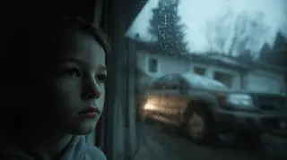
- **Prompt:** `RI · Memory Storage Retrieval · The ghost child vanishes, leaving the young POET alone at the window, observing parents arguing in the car outside · Photo-realistic, melancholic, return to original scene, focus on young POET's isolated expression, dim interior, tense car interior visible through window.`
- **In the cuts:**
  - suite: BR (shots from 2 films, no time between them: a category) · Moonwalk One, ca. 1970 (1970); Alice In Wonderland (1915)
  - scenes: BR (shots from 2 films, no time between them: a category) · AUTOMOBILE ECONOMY TEST, ca. 1938 (n.d.); NASA Searches for Life from the Moon in Recently (1969)
  - cineosis: BR (shots from 2 films, no time between them: a category) · De Joodsche invalide (1939); Kinderen naar buiten (1935)
  - drift: BR (shots from 2 films, no time between them: a category) · Ripley's Believe it or Not Museum - Gatlinburg,  (2007); Apollo 12: Pinpoint for Science (1969)

### Syntagma 14 (SY14)
- **Type (intended):** Chronological Syntagma (CS) [24–27] · on Metz's table: chronological (SC · SEQ · EP · ALT)
- **Purpose:** Causal Motion Trigger
- **Read in the cuts:** suite BR×3, AS · scenes SEQ, AS, SC, BR · cineosis BR×3, AS · drift BR×3, AS
- **Intended type realised:** 12% of shot-by-cut pairs

#### Shot 24 (SH24) · WGY024
- **Content:** The ghost child reappears, presenting a tambourine to the young POET.
- **Scene:** Ghost child hands Young POET tambourine.
- **Angle:** —
- **Duration:** 9.1 s (3:20–3:29, beat 23 · Ghost gives the tambourine · match 0.67)
- **Movement:** —
- **Function:** Causal Motion Trigger · Action-Image
- **Her words:** “and the whispering screams of two souls on a road winding down. / And no tears and no fucks, no love to give, old to teach.”
- **Image:** 
- **Prompt:** `CS · Causal Motion Trigger · The ghost child reappears, presenting a tambourine to the young POET · Photo-realistic, mystical element, soft, glowing tambourine, a moment of connection and subtle surprise.`
- **In the cuts:**
  - suite: BR (shots from 2 films, no time between them: a category) · Alice In Wonderland (1915); Verkade's fabrieken te Zaandam (1930)
  - scenes: SEQ (one film, moments skipped) · NASA Searches for Life from the Moon in Recently (1969); NASA Searches for Life from the Moon in Recently (1969)
  - cineosis: BR (shots from 2 films, no time between them: a category) · Kinderen naar buiten (1935); Fastax-tion (n.d.)
  - drift: BR (shots from 2 films, no time between them: a category) · Apollo 12: Pinpoint for Science (1969); Communications Primer, A (n.d.)

#### Shot 25 (SH25) · WGY025
- **Content:** The young POET throws the tambourine through the window, causing it to shatter dramatically.
- **Scene:** Young POET throws tambourine, shattering window.
- **Angle:** —
- **Duration:** 4.6 s (3:29–3:34, beat 24 · Tambourine through the window · match 1.0)
- **Movement:** —
- **Function:** Causal Motion Trigger · Action-Image
- **Her words:** — (instrumental)
- **Image:** 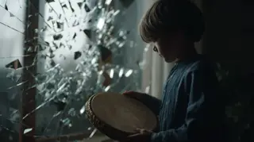
- **Prompt:** `CS · Causal Motion Trigger · The young POET throws the tambourine through the window, causing it to shatter dramatically · Photo-realistic, impactful, slow-motion glass shattering, sharp sound design, focus on the child's raw emotion, stark light.`
- **In the cuts:**
  - suite: AS (one shot holds the whole slot) · Verkade's fabrieken te Zaandam (1930)
  - scenes: AS (one shot holds the whole slot) · NASA Searches for Life from the Moon in Recently (1969)
  - cineosis: AS (one shot holds the whole slot) · Fastax-tion (n.d.)
  - drift: AS (one shot holds the whole slot) · Communications Primer, A (n.d.)

#### Shot 26 (SH26) · WGY026
- **Content:** The tambourine is seen endlessly falling, flying, and tumbling through a vast, black void.
- **Scene:** Tambourine falls, flies, tumbles through black space.
- **Angle:** —
- **Duration:** 9.0 s (3:34–3:43, beat 25 · Tambourine tumbles in black · match 1.0)
- **Movement:** falling
- **Function:** Causal Motion Trigger · Action-Image
- **Her words:** “Old to forever, a tambourine sounds off an empty temple, empty choir stands, empty prayer lines, and abandoned Baptist pools,”
- **Image:** 
- **Prompt:** `CS · Causal Motion Trigger · The tambourine is seen endlessly falling, flying, and tumbling through a vast, black void · Photo-realistic, surreal, isolated object, slow-motion, subtle light catching the tambourine, sense of prolonged descent.`
- **In the cuts:**
  - suite: BR (shots from 2 films, no time between them: a category) · Sound Waves And Their Sources (1933); Panama-Pacific International Exposition (1940)
  - scenes: SC (one film, no time skipped) · Space Ship Takeoff, a Technical Fantasy (1937); Space Ship Takeoff, a Technical Fantasy (1937)
  - cineosis: BR (shots from 2 films, no time between them: a category) · Sound Waves And Their Sources (1933); The Electric House (1922)
  - drift: BR (shots from 2 films, no time between them: a category) · Moonwalk One, ca. 1970 (1970); Spider Engineers (1956)

#### Shot 27 (SH27) · WGY027
- **Content:** The tambourine, miraculously intact, flies through a chapel window.
- **Scene:** Tambourine flies into chapel window, still whole.
- **Angle:** —
- **Duration:** 9.1 s (3:43–3:52, beat 26 · Object enters chapel through intact window · match 0.67)
- **Movement:** —
- **Function:** Causal Motion Trigger · Action-Image
- **Her words:** “Old to forever, a tambourine sounds off an empty temple, empty choir stands, empty prayer lines, and abandoned Baptist pools,”
- **Image:** 
- **Prompt:** `CS · Causal Motion Trigger · The tambourine, miraculously intact, flies through a chapel window · Photo-realistic, magical realism, warm interior light, stained-glass details, seamless entry, moment of unexpected arrival.`
- **In the cuts:**
  - suite: BR (shots from 2 films, no time between them: a category) · Panama-Pacific International Exposition (1940); The Playhouse (1921)
  - scenes: BR (shots from 2 films, no time between them: a category) · Space Ship Takeoff, a Technical Fantasy (1937); Weesp (1928)
  - cineosis: BR (shots from 2 films, no time between them: a category) · The Electric House (1922); SPACE AGE RAILROAD (1969)
  - drift: BR (shots from 2 films, no time between them: a category) · Spider Engineers (1956); FIVE ARTISTS (1971)

### Syntagma 15 (SY15)
- **Type (intended):** Descriptive Syntagma (DS) [28] · on Metz's table: DESC
- **Purpose:** Mood Environment Stabilizer
- **Read in the cuts:** suite BR · scenes BR · cineosis BR · drift BR
- **Intended type realised:** 0% of shot-by-cut pairs

#### Shot 28 (SH28) · WGY028
- **Content:** A time-lapse sequence shows the rapid decay of the chapel through detailed close-up shots.
- **Scene:** Time-lapse chapel decay, close-ups.
- **Angle:** close-up
- **Duration:** 13.6 s (4:05–4:19, beat 28 · Accelerated chapel decay · match 0.67)
- **Movement:** —
- **Function:** Mood Environment Stabilizer · Descriptive Image
- **Her words:** “Spirits have left salvations and opened gift boxes placed outside the side doors. / It thunders, then it rains until nothing remains. / Old to the storm ending, what was once love now goods,”
- **Image:** 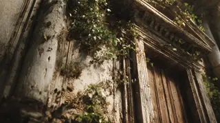
- **Prompt:** `DS · Mood Environment Stabilizer · A time-lapse sequence shows the rapid decay of the chapel through detailed close-up shots · Time-lapse photo-realistic, accelerated decay, crumbling stone, rotting wood, dust and plant growth, granular detail, somber tones.`
- **In the cuts:**
  - suite: BR (shots from 3 films, no time between them: a category) · Wreckless (1935); General Health Habits (1928); Nederlandsche Heide Maatschappij en haar werk (1934)
  - scenes: BR (shots from 2 films, no time between them: a category) · JFK EXHIBIT 3: RECONSTRUCTION FILM (1943); The Green Promise (1949); The Green Promise (1949)
  - cineosis: BR (shots from 3 films, no time between them: a category) · Great American Chocolate Factory, The (n.d.); Delft (1923); Demolition of W.L. Chenery Middle School (1996)
  - drift: BR (shots from 3 films, no time between them: a category) · Place to Live, A (1948); Daydreams (1922); Amateur Film New Jersey B (n.d.)

### Syntagma 16 (SY16)
- **Type (intended):** Chronological Syntagma (CS) [29] · on Metz's table: chronological (SC · SEQ · EP · ALT)
- **Purpose:** Causal Motion Trigger
- **Read in the cuts:** suite BR · scenes BR · cineosis BR · drift BR
- **Intended type realised:** 0% of shot-by-cut pairs

#### Shot 29 (SH29) · WGY029
- **Content:** A violent storm accelerates the chapel's disintegration.
- **Scene:** Heavy storm speeds chapel decay.
- **Angle:** —
- **Duration:** 9.1 s (4:19–4:28, beat 29 · Thunderstorm consumes the chapel · match 0.33)
- **Movement:** —
- **Function:** Causal Motion Trigger · Action-Image
- **Her words:** “Old to the storm ending, what was once love now goods, / broken and sealed apart by lightning, / daily breads soaked and delivered rotted by rain,”
- **Image:** 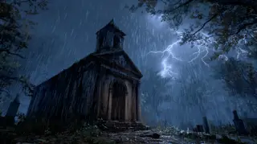
- **Prompt:** `CS · Causal Motion Trigger · A violent storm accelerates the chapel's disintegration · Time-lapse photo-realistic, dramatic, heavy rain, lightning flashes, wind effects, amplified decay, dark and moody.`
- **In the cuts:**
  - suite: BR (shots from 2 films, no time between them: a category) · Nederlandsche Heide Maatschappij en haar werk (1934); Old Time Tractor Plowing Dry Land (1936)
  - scenes: BR (shots from 2 films, no time between them: a category) · The Green Promise (1949); American Frontier (Part I) (1953)
  - cineosis: BR (shots from 2 films, no time between them: a category) · Demolition of W.L. Chenery Middle School (1996); Visions of the wild (1985)
  - drift: BR (shots from 2 films, no time between them: a category) · Amateur Film New Jersey B (n.d.); South Chile (1945)

### Syntagma 17 (SY17)
- **Type (intended):** Descriptive Syntagma (DS) [30] · on Metz's table: DESC
- **Purpose:** Mood Environment Stabilizer
- **Read in the cuts:** suite BR · scenes BR · cineosis BR · drift BR
- **Intended type realised:** 0% of shot-by-cut pairs

#### Shot 30 (SH30) · WGY030
- **Content:** The storm ceases, revealing only scattered remnants of the chapel washed ashore.
- **Scene:** Storm ends, chapel remnants on shore.
- **Angle:** —
- **Duration:** 13.6 s (4:28–4:41, beat 30 · Storm clears onto shoreline ruins · match 0.2)
- **Movement:** —
- **Function:** Mood Environment Stabilizer · Descriptive Image
- **Her words:** “and blankets soiled by venomous puppeteers, / old to two sets of button-printed footsteps, / and a tambourine shattered into pieces.”
- **Image:** 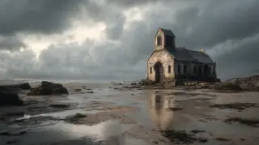
- **Prompt:** `DS · Mood Environment Stabilizer · The storm ceases, revealing only scattered remnants of the chapel washed ashore · Photo-realistic, calm aftermath, wet sand, broken stone and wood, muted light, desolate landscape.`
- **In the cuts:**
  - suite: BR (shots from 3 films, no time between them: a category) · Old Time Tractor Plowing Dry Land (1936); Zuyderzee works (1930); All My Babies (1953)
  - scenes: BR (shots from 2 films, no time between them: a category) · American Frontier (Part I) (1953); Apollo 12: Pinpoint for Science (1969); Apollo 12: Pinpoint for Science (1969)
  - cineosis: BR (shots from 3 films, no time between them: a category) · Visions of the wild (1985); Road Runners (1952); Moonwalk One, ca. 1970 (1970)
  - drift: BR (shots from 3 films, no time between them: a category) · South Chile (1945); Zuyderzee works (1930); American Frontier (Part I) (1953)

### Syntagma 18 (SY18)
- **Type (intended):** Chronological Syntagma (CS) [31] · on Metz's table: chronological (SC · SEQ · EP · ALT)
- **Purpose:** Causal Motion Trigger
- **Read in the cuts:** suite AS · scenes AS · cineosis AS · drift AS
- **Intended type realised:** 0% of shot-by-cut pairs

#### Shot 31 (SH31) · WGY031
- **Content:** The tambourine finally lands amidst the chapel ruins and breaks into pieces.
- **Scene:** Tambourine lands on chapel remnants, shatters.
- **Angle:** —
- **Duration:** 4.5 s (4:41–4:46, beat 31 · Tambourine lands and shatters · match 1.0)
- **Movement:** —
- **Function:** Causal Motion Trigger · Action-Image
- **Her words:** — (instrumental)
- **Image:** 
- **Prompt:** `CS · Causal Motion Trigger · The tambourine finally lands amidst the chapel ruins and breaks into pieces · Photo-realistic, impact, slow-motion shattering, fragments scattering, sense of finality, muted light.`
- **In the cuts:**
  - suite: AS (one shot holds the whole slot) · All My Babies (1953)
  - scenes: AS (one shot holds the whole slot) · Apollo 12: Pinpoint for Science (1969)
  - cineosis: AS (one shot holds the whole slot) · Moonwalk One, ca. 1970 (1970)
  - drift: AS (one shot holds the whole slot) · American Frontier (Part I) (1953)

### Syntagma 19 (SY19)
- **Type (intended):** Descriptive Syntagma (DS) [32] · on Metz's table: DESC
- **Purpose:** Mood Environment Stabilizer
- **Read in the cuts:** suite BR · scenes SEQ · cineosis BR · drift BR
- **Intended type realised:** 0% of shot-by-cut pairs

#### Shot 32 (SH32) · WGY032
- **Content:** POET, now in a striking red/black outfit with sunglasses, stands on the twilight shore, hands in pockets.
- **Scene:** POET in Red/Black outfit, sunglasses, on shore at night, hands in pockets.
- **Angle:** silhouette
- **Duration:** 10.2 s (4:46–4:56, beat 32 · Heartless Poet surveys the shore · match 0.5)
- **Movement:** —
- **Function:** Mood Environment Stabilizer · Descriptive Image
- **Her words:** “What if I follow this trail to where the broken pieces have washed ashore and the ashes of expired wildfires”
- **Image:** 
- **Prompt:** `DS · Mood Environment Stabilizer · POET, now in a striking red/black outfit with sunglasses, stands on the twilight shore, hands in pockets · Photo-realistic, cinematic, strong silhouette, contrasting red/black outfit, cool night/twilight tones, reflective sunglasses, stoic posture.`
- **In the cuts:**
  - suite: BR (shots from 3 films, no time between them: a category) · Out West (1918); Colaci Home Movies: Family 1952-1956 (Part I) (1952); Mother Mack Trains Her Seven Puppies (1952)
  - scenes: SEQ (one film, source order unknown) · Watershed wildfire (1958); Watershed wildfire (1958); Watershed wildfire (1958)
  - cineosis: BR (shots from 3 films, no time between them: a category) · Zuyderzee works (1930); Alaska's Silver Millions (Part I) (1936); Celebrating Chincoteague National Wildlife Refug (2006)
  - drift: BR (shots from 3 films, no time between them: a category) · Apollo 12: Pinpoint for Science (1969); A Very Special Place (1994); Vision of the Wild (1990)

### Syntagma 20 (SY20)
- **Type (intended):** Autonomous Syntagma (AS) [33] · on Metz's table: AS
- **Purpose:** Emotion Relay
- **Read in the cuts:** suite BR · scenes SEQ · cineosis BR · drift BR
- **Intended type realised:** 0% of shot-by-cut pairs

#### Shot 33 (SH33) · WGY033
- **Content:** An internal view reveals POET's chest cavity is empty where a heart should be, perhaps with a subtle glow.
- **Scene:** POET has no heart.
- **Angle:** —
- **Duration:** 10.2 s (4:56–5:06, beat 32 · Heartless Poet surveys the shore · match 0.25)
- **Movement:** —
- **Function:** Emotion Relay · Affection-Image
- **Her words:** “What if I follow this trail to where the broken pieces have washed ashore and the ashes of expired wildfires / cover sands and debris / lift it from the night seawater's floor. / The waves will calm to fold it whispers and the winds will mute the trees for the right level of silence”
- **Image:** 
- **Prompt:** `AF · Emotion Relay · An internal view reveals POET's chest cavity is empty where a heart should be, perhaps with a subtle glow · Photo-realistic, surreal, X-ray or internal view effect, empty chest cavity, cold light, symbolic void.`
- **In the cuts:**
  - suite: BR (shots from 3 films, no time between them: a category) · Out West (1918); Colaci Home Movies: Family 1952-1956 (Part I) (1952); Mother Mack Trains Her Seven Puppies (1952)
  - scenes: SEQ (one film, source order unknown) · Watershed wildfire (1958); Watershed wildfire (1958); Watershed wildfire (1958)
  - cineosis: BR (shots from 3 films, no time between them: a category) · Zuyderzee works (1930); Alaska's Silver Millions (Part I) (1936); Celebrating Chincoteague National Wildlife Refug (2006)
  - drift: BR (shots from 3 films, no time between them: a category) · Apollo 12: Pinpoint for Science (1969); A Very Special Place (1994); Vision of the Wild (1990)

### Syntagma 21 (SY21)
- **Type (intended):** Chronological Syntagma (CS) [34] · on Metz's table: chronological (SC · SEQ · EP · ALT)
- **Purpose:** Causal Motion Trigger
- **Read in the cuts:** suite BR · scenes BR · cineosis BR · drift BR
- **Intended type realised:** 0% of shot-by-cut pairs

#### Shot 34 (SH34) · WGY034
- **Content:** POET strolls along the shore, observing the decay and shattered remnants, hands remaining hidden in pockets, as ravens fly ominously overhead.
- **Scene:** POET walks along shore, observing decay, ravens overhead.
- **Angle:** overhead, silhouette
- **Duration:** 13.6 s (5:06–5:20, beat 33 · Ravens over debris and footprints · match 0.25)
- **Movement:** —
- **Function:** Causal Motion Trigger · Action-Image
- **Her words:** “The waves will calm to fold it whispers and the winds will mute the trees for the right level of silence / to find a throbbing heart left at the midlife corner returned toward the incline. / A familiar heart”
- **Image:** 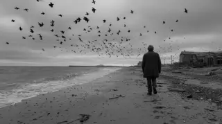
- **Prompt:** `CS · Causal Motion Trigger · POET strolls along the shore, observing the decay and shattered remnants, hands remaining hidden in pockets, as ravens fly ominously overhead · Photo-realistic, contemplative, slow walking motion, focus on debris, ravens in silhouette, cold and desolate mood.`
- **In the cuts:**
  - suite: BR (shots from 2 films, no time between them: a category) · Mother Mack Trains Her Seven Puppies (1952); Oil Across Arabia (1950)
  - scenes: BR (shots from 2 films, no time between them: a category) · Watershed wildfire (1958); Alice In Wonderland (1915)
  - cineosis: BR (shots from 2 films, no time between them: a category) · Celebrating Chincoteague National Wildlife Refug (2006); Garden Wise (Pt 2) (n.d.)
  - drift: BR (shots from 2 films, no time between them: a category) · Vision of the Wild (1990); Alice In Wonderland (1915)

# Act 2 (A2): Confrontation

**Purpose:** The other world, its promise and its cost. On the clock 5:27–18:32, across: NEVERMORE, BLOODLINES, RESURRECTING ATLANTIS, DJ TURN ME UP, NEWLY SINGLE, YET, HEARD, MAGIC RIDE.

## Break into Two

**Purpose:** The hero chooses to enter the upside-down world. Here: SH35–SH35, 5:20–5:40, NEVERMORE.

### Syntagma 22 (SY22)
- **Type (intended):** Chronological Syntagma (CS) [35] · on Metz's table: chronological (SC · SEQ · EP · ALT)
- **Purpose:** Causal Motion Trigger
- **Read in the cuts:** suite BR · scenes SEQ · cineosis BR · drift BR
- **Intended type realised:** 25% of shot-by-cut pairs

#### Shot 35 (SH35) · WGY035
- **Content:** A luminous heart floats on the shore, drawn to POET, and re-enters their chest, without POET removing hands from pockets.
- **Scene:** POET finds floating heart on shore, reenters body.
- **Angle:** —
- **Duration:** 20.3 s (5:20–5:40, beat 34 · Heart floats from shore into Poet · match 1.0)
- **Movement:** —
- **Function:** Causal Motion Trigger · Action-Image
- **Her words:** “A familiar heart / which has shaken off every sad blue note life can perform / to overcome and spread inspiration / and it used to be mine. I'll lift it with care putting it back in place and tell myself / nevermore. / What if I follow this reclaimed heart to where the puzzle pieces of faith are handcrafted”
- **Image:** 
- **Prompt:** `CS · Causal Motion Trigger · A luminous heart floats on the shore, drawn to POET, and re-enters their chest, without POET removing hands from pockets · Photo-realistic, magical realism, glowing heart, subtle upward motion, seamless integration into POET's body, warm light emanating from heart.`
- **In the cuts:**
  - suite: BR (shots from 3 films, no time between them: a category) · Oil Across Arabia (1950); Alice In Wonderland (1915); Garden Wise (Pt 2) (n.d.)
  - scenes: SEQ (one film, source order unknown, with an insert) · Alice In Wonderland (1915); Alice In Wonderland (1915); Garden Wise (Pt 1) (n.d.)
  - cineosis: BR (shots from 3 films, no time between them: a category) · Garden Wise (Pt 2) (n.d.); Mobile Lab : Any Questions? (1974); Victory Gardens (n.d.)
  - drift: BR (shots from 3 films, no time between them: a category) · Alice In Wonderland (1915); Amateur Film - Little Journeys to Niagara (1931); Liberty (n.d.)

## B Story

**Purpose:** A second thread, often a relationship, that carries the theme. Here: SH36–SH38, 5:40–6:41, NEVERMORE.

### Syntagma 23 (SY23)
- **Type (intended):** Chronological Syntagma (CS) [36–37] · on Metz's table: chronological (SC · SEQ · EP · ALT)
- **Purpose:** Causal Motion Trigger
- **Read in the cuts:** suite BR×2 · scenes SEQ×2 · cineosis BR×2 · drift BR×2
- **Intended type realised:** 25% of shot-by-cut pairs

#### Shot 36 (SH36) · WGY036
- **Content:** POET follows a discernible trail leading from the shore up to an open field, with ravens still circling above.
- **Scene:** POET follows trail to field, ravens overhead.
- **Angle:** silhouette
- **Duration:** 20.4 s (5:40–6:01, beat 35 · Follow a trail uphill toward the field · match 0.6)
- **Movement:** —
- **Function:** Causal Motion Trigger · Action-Image
- **Her words:** “What if I follow this reclaimed heart to where the puzzle pieces of faith are handcrafted / scrambled and scattered as mustard seas into the vast moonlight night's field. / The plants in a golden hue bloom and face toward me in anticipation. / The weeds repel falling into the shadows where our memories hide and mean so little in moments of defeat / as I'm called forward.”
- **Image:** 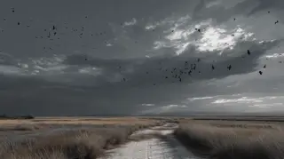
- **Prompt:** `CS · Causal Motion Trigger · POET follows a discernible trail leading from the shore up to an open field, with ravens still circling above · Photo-realistic, sense of new direction, subtle path of light or texture, ravens in silhouette, transition from shore to open land.`
- **In the cuts:**
  - suite: BR (shots from 3 films, no time between them: a category) · Garden Wise (Pt 2) (n.d.); Indië-materiaal van Willy Mullens (1926); Wheels of Progress (1950)
  - scenes: SEQ (one film, source order unknown, with an insert) · Garden Wise (Pt 1) (n.d.); Garden Wise (Pt 1) (n.d.); [Amateur film: Medicus collection: New York Worl (1939)
  - cineosis: BR (shots from 3 films, no time between them: a category) · Victory Gardens (n.d.); Frontiers of the Future (A Screen Editorial With (1937); Promise of Pakistan Geography (1950)
  - drift: BR (shots from 3 films, no time between them: a category) · Liberty (n.d.); Watershed wildfire (1958); Cabeza Prieta National Wildlife Refuge Desert Wi (2006)

#### Shot 37 (SH37) · WGY037
- **Content:** POET continues to walk through the expansive field, hands remaining in pockets.
- **Scene:** POET walks through field, hands in pockets.
- **Angle:** wide shot
- **Duration:** 13.6 s (6:01–6:14, beat 36 · Golden plants turn toward Poet; weeds withdraw · match 0.14)
- **Movement:** pan
- **Function:** Causal Motion Trigger · Action-Image
- **Her words:** “as I'm called forward. / The clouds meet the stars for the deepest level of darkness welcoming extra hard work / to search for the bare ground for two hands. Hands that once could tusk dusk after dusk”
- **Image:** 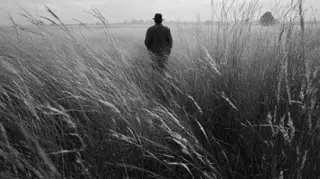
- **Prompt:** `CS · Causal Motion Trigger · POET continues to walk through the expansive field, hands remaining in pockets · Photo-realistic, wide shot of field, perhaps tall grass, subtle movement of POET, sense of journey, internal focus.`
- **In the cuts:**
  - suite: BR (shots from 3 films, no time between them: a category) · Wheels of Progress (1950); Bacteria: Friend and Foe (n.d.); Who's Out There? (1975)
  - scenes: SEQ (one film, source order unknown) · [Amateur film: Medicus collection: New York Worl (1939); [Amateur film: Medicus collection: New York Worl (1939); [Amateur film: Medicus collection: New York Worl (1939)
  - cineosis: BR (shots from 3 films, no time between them: a category) · Promise of Pakistan Geography (1950); Garden Wise (Pt 1) (n.d.); Alcohol and the Human Body (1949)
  - drift: BR (shots from 3 films, no time between them: a category) · Cabeza Prieta National Wildlife Refuge Desert Wi (2006); House of the woods: A forest trilogy (1983); Legacy for Wings (1984)

### Syntagma 24 (SY24)
- **Type (intended):** Descriptive Syntagma (DS) [38] · on Metz's table: DESC
- **Purpose:** Subjective Frame Recalibration
- **Read in the cuts:** suite BR · scenes SEQ · cineosis BR · drift BR
- **Intended type realised:** 0% of shot-by-cut pairs

#### Shot 38 (SH38) · WGY038
- **Content:** POET subtly searches for hands within the shadows of the field, hands still kept in pockets.
- **Scene:** POET searches for hands in field shadows.
- **Angle:** —
- **Duration:** 13.6 s (6:28–6:41, beat 38 · Search bare ground for lost hands · match 0.2)
- **Movement:** —
- **Function:** Subjective Frame Recalibration · Perception-Image
- **Her words:** “I put them back on with the care of my future at stake and say to myself / nevermore. I've wanted the world and lost my soul. / I want nothing more than to just be myself and nothing more / and be alright. I do believe I'll be alright.”
- **Image:** 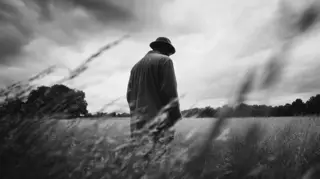
- **Prompt:** `PI · Subjective Frame Recalibration · POET subtly searches for hands within the shadows of the field, hands still kept in pockets · Photo-realistic, suggestive and subtle movements, emphasis on the shadows and negative space, a sense of quiet desperation or yearning.`
- **In the cuts:**
  - suite: BR (shots from 3 films, no time between them: a category) · Moonwalk One, ca. 1970 (1970); ANTARTICA, 1939 - 1941 (1939); Wording standbeeld van stadhouder Willem III (1921)
  - scenes: SEQ (one film, moments skipped, with an insert) · Apollo 12: Pinpoint for Science (1969); Apollo 12: Pinpoint for Science (1969); Master Hands (n.d.)
  - cineosis: BR (shots from 3 films, no time between them: a category) · [Amateur films: Ivan Besse collection: Britton,  (1938); Moonwalk One, ca. 1970 (1970); All My Babies (1953)
  - drift: BR (shots from 3 films, no time between them: a category) · Sunset Clouds (Wide Screen) (2007); Night Tree (2006); Garden Wise (Pt 1) (n.d.)

## Fun and Games

**Purpose:** The promise of the premise: the new world explored. Here: SH39–SH46, 6:41–12:12, NEVERMORE, BLOODLINES, RESURRECTING ATLANTIS, DJ TURN ME UP.

### Syntagma 25 (SY25)
- **Type (intended):** Chronological Syntagma (CS) [39] · on Metz's table: chronological (SC · SEQ · EP · ALT)
- **Purpose:** Causal Motion Trigger
- **Read in the cuts:** suite BR · scenes SEQ · cineosis BR · drift BR
- **Intended type realised:** 25% of shot-by-cut pairs

#### Shot 39 (SH39) · WGY039
- **Content:** POET finds and reattaches hands, then stands contemplatively in the field.
- **Scene:** POET finds hands, puts them on, reflects in field.
- **Angle:** —
- **Duration:** 20.4 s (6:41–7:02, beat 39 · Hands restored; Poet stands reflecting · match 0.6)
- **Movement:** —
- **Function:** Causal Motion Trigger · Action-Image
- **Her words:** “and be alright. I do believe I'll be alright. / This reclaimed and dust settled heart rediscovered but dusted hands remind me / but say to me in this still muted tree in night garden feels silence / nevermore. / Now go.”
- **Image:** 
- **Prompt:** `CS · Causal Motion Trigger · POET finds and reattaches hands, then stands contemplatively in the field · Photo-realistic, moment of realization or completion, subtle magical effect as hands reattach, POET's reflective posture, soft lighting.`
- **In the cuts:**
  - suite: BR (shots from 3 films, no time between them: a category) · Wording standbeeld van stadhouder Willem III (1921); EVOLUTION OF THE OIL INDUSTRY, THE (1934); Moonwalk One, ca. 1970 (1970)
  - scenes: SEQ (one film, moments skipped) · Master Hands (n.d.); Master Hands (n.d.); Master Hands (n.d.)
  - cineosis: BR (shots from 3 films, no time between them: a category) · All My Babies (1953); Have I Told You Lately That I Love You? (1958); THE PHOTOGRAPHER (1948)
  - drift: BR (shots from 3 films, no time between them: a category) · Garden Wise (Pt 1) (n.d.); Garden Wise (Pt 2) (n.d.); House of the woods: A forest trilogy (1983)

### Syntagma 26 (SY26)
- **Type (intended):** Descriptive Syntagma (DS) [40] · on Metz's table: DESC
- **Purpose:** Narrative Modifier
- **Read in the cuts:** suite BR · scenes BR · cineosis BR · drift BR
- **Intended type realised:** 0% of shot-by-cut pairs

#### Shot 40 (SH40) · WGY040
- **Content:** In the still night, POET enters a vibrant, welcoming parade of afro-futuristic ancestors who bestow stars, galaxies, and universes upon him.
- **Scene:** POET enters afro-futuristic ancestors' parade, receives stars, galaxies, universes.
- **Angle:** —
- **Duration:** 24.8 s (7:35–8:00, beat 41 · Ancestors offer stars and galaxies · match 0.75)
- **Movement:** —
- **Function:** Narrative Modifier · Thematic Montage
- **Her words:** “of southern pine could comfort my spine, it didn't. / To dream was to prevail. / They tell me to ask if I can invent a new universe, / to ask if God would let me, little old me, / award a blessing here or there. / Even grant miracles where the needs / of the spoken word exists. / In uncertain times, in forsaken times,”
- **Image:** 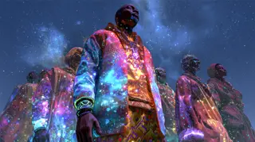
- **Prompt:** `DS · Narrative Modifier · In the still night, POET enters a vibrant, welcoming parade of afro-futuristic ancestors who bestow stars, galaxies, and universes upon him · Afro-futuristic photo-realistic, vibrant colors, glowing patterns on clothing and skin, cosmic elements (stars, galaxies) integrated into the parade, sense of ancient wisdom meets future, celebratory and empowering atmosphere.`
- **In the cuts:**
  - suite: BR (shots from 5 films, no time between them: a category) · ANTARTICA, 1939 - 1941 (1939); Appreciating Our Parents (1950); De Joodsche invalide (1939); Looking Ahead Through Plexiglas A (n.d.); Muller en co n.v. Rotterdam (1928)
  - scenes: BR (shots from 3 films, no time between them: a category) · [Amateur film: Medicus collection: New York Worl (1939); [Amateur film: Medicus collection: New York Worl (1939); NASA Searches for Life from the Moon in Recently (1969); NASA Searches for Life from the Moon in Recently (1969); Alice In Wonderland (1915)
  - cineosis: BR (shots from 5 films, no time between them: a category) · Modesta (n.d.); Precisely So (Part I) (1937); Moonwalk One, ca. 1970 (1970); Eat for Health (1954); Indië-materiaal van Willy Mullens (1926)
  - drift: BR (shots from 5 films, no time between them: a category) · Apollo 12: Pinpoint for Science (1969); Anthracite: Pre-Shift Examinations of Undergroun (1994); [Amateur film: Wathen collection: New York World (1939); A Very Special Place (1994); Parks as Classrooms (1994)

### Syntagma 27 (SY27)
- **Type (intended):** Chronological Syntagma (CS) [41–46] · on Metz's table: chronological (SC · SEQ · EP · ALT)
- **Purpose:** Causal Motion Trigger
- **Read in the cuts:** suite BR×5, ALT · scenes BR×5, SEQ · cineosis BR×6 · drift BR×6
- **Intended type realised:** 8% of shot-by-cut pairs

#### Shot 41 (SH41) · WGY041
- **Content:** In the still night, POET discovers and enters the entrance to Atlantis, immersing in the vibrant cyberpunk city.
- **Scene:** POET sees Atlantis entrance, enters, experiences cyberpunk city.
- **Angle:** —
- **Duration:** 33.1 s (8:33–9:06, beat 44 · Winged marble gates open · match 0.0)
- **Movement:** —
- **Function:** Causal Motion Trigger · Action-Image
- **Her words:** “The gates open with wings gifted from evolution, and made of marble stones / kissed by the hymns our creator composed with an orchestra of our ancestors wildest dreams to / welcome us. Poets who eased generations down yellow brick roads and plucked our souls out / of their secret places to follow comets to the capital city of our collective consciousness, / resurrecting Atlantis. Here we are all one. The pack we've made here with nature”
- **Image:** 
- **Prompt:** `CS · Causal Motion Trigger · In the still night, POET discovers and enters the entrance to Atlantis, immersing in the vibrant cyberpunk city · Photo-realistic cyberpunk, neon-drenched city, rain-slicked streets, holographic projections, futuristic architecture, POET's figure entering a portal or grand entrance, sense of awe and discovery.`
- **In the cuts:**
  - suite: BR (shots from 4 films, no time between them: a category) · The Middleton Family at the New York World's Fai (n.d.); Miss Clark Introduces Panorama (1960); [Amateur film: San Francisco] (1940); Friendship Seven (1962)
  - scenes: BR (shots from 2 films, no time between them: a category) · AUTOMOBILE ECONOMY TEST, ca. 1938 (n.d.); AUTOMOBILE ECONOMY TEST, ca. 1938 (n.d.); Muller en co n.v. Rotterdam (1928); Muller en co n.v. Rotterdam (1928)
  - cineosis: BR (shots from 4 films, no time between them: a category) · Opening tramlijn naar Wassenaar (1923); Moonwalk One, ca. 1970 (1970); Alice In Wonderland (1915); Amateur Film Northwest (n.d.)
  - drift: BR (shots from 4 films, no time between them: a category) · Apollo 12: Pinpoint for Science (1969); Airport America (1954); Aerial Views of Manhattan and Hudson River, New  (1967); [Amateur film: Medicus collection: New York Worl (1939)

#### Shot 42 (SH42) · WGY042
- **Content:** As the voiceover concludes, POET continues to wander through the bustling, futuristic city of Atlantis.
- **Scene:** Voiceover ends, POET wanders through Atlantis.
- **Angle:** —
- **Duration:** 44.1 s (9:06–9:50, beat 45 · Candlelit narrow streets, welcoming faces · match 0.0)
- **Movement:** —
- **Function:** Causal Motion Trigger · Action-Image
- **Her words:** “resurrecting Atlantis. Here we are all one. The pack we've made here with nature / abandon and hope for the best back on life. A relearned currency we reassess as a mission, / but here we are all safe. Here we are all one. The pack we've made here with nature / abandon and hope for the best back on life. A relearned currency we reassess as a mission, / but here we are all safe. An unfamiliar flickering candlelight illuminating smiles / at night where shadows cast from narrow streets beaming with love, and the joyful noises that”
- **Image:** 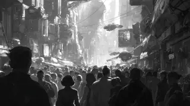
- **Prompt:** `CS · Causal Motion Trigger · As the voiceover concludes, POET continues to wander through the bustling, futuristic city of Atlantis · Photo-realistic cyberpunk, continuation of prior style, emphasis on POET's contemplative movement through the city, visual detail of crowds and urban environment.`
- **In the cuts:**
  - suite: BR (shots from 5 films, no time between them: a category) · Friendship Seven (1962); Volkshuisvesting (1922); Oud-Amsterdam (1923); Weesp (1928); 'Till It Helps! (1959)
  - scenes: BR (shots from 3 films, no time between them: a category) · Muller en co n.v. Rotterdam (1928); Under Western Stars (n.d.); Under Western Stars (n.d.); Street of Memory (1937); Street of Memory (1937)
  - cineosis: BR (shots from 5 films, no time between them: a category) · Amateur Film Northwest (n.d.); Straight Talk (1992); Moonwalk One, ca. 1970 (1970); Taiwan (1960); Destruction: Fun or Dumb? (n.d.)
  - drift: BR (shots from 5 films, no time between them: a category) · [Amateur film: Medicus collection: New York Worl (1939); Middle America (1953); Coffee House Rendezvous (Part I) (1969); Friendship Seven (1962); Wheels of Progress (1950)

#### Shot 43 (SH43) · WGY043
- **Content:** POET finally reaches a house where people are entering and goes inside.
- **Scene:** POET arrives at house, enters.
- **Angle:** —
- **Duration:** 33.1 s (9:50–10:23, beat 46 · Voiceover stops; wander toward a house · match 0.2)
- **Movement:** —
- **Function:** Causal Motion Trigger · Action-Image
- **Her words:** “at night where shadows cast from narrow streets beaming with love, and the joyful noises that / color rainbows, and give us infinite time to heal and set clouds free. I know my soul and / it could stay here forever, leaving behind crosshairs for continuums and strains for / serendipity. A city born in unison out of the purest of fictions welcoming me and welcoming all.”
- **Image:** 
- **Prompt:** `CS · Causal Motion Trigger · POET finally reaches a house where people are entering and goes inside · Photo-realistic cyberpunk, transition from public streets to a specific building, intimate lighting, sense of anticipation for what's inside.`
- **In the cuts:**
  - suite: BR (shots from 4 films, no time between them: a category) · Moonwalk One, ca. 1970 (1970); Amateur Film Medicus09a (n.d.); Third Avenue El (n.d.); Gouda (1923)
  - scenes: BR (shots from 2 films, no time between them: a category) · Moonwalk One, ca. 1970 (1970); Moonwalk One, ca. 1970 (1970); [Amateur film: Medicus collection: New York Worl (1939); [Amateur film: Medicus collection: New York Worl (1939)
  - cineosis: BR (shots from 4 films, no time between them: a category) · ABCs of Walking Wisely (1959); Spot News (1937); SPACE AGE RAILROAD (1969); Gouda (1923)
  - drift: BR (shots from 4 films, no time between them: a category) · Dynamic American City, The (Part I) (1956); Stormy Clouds Sequence (Wide Screen) (2007); Apollo 13 Splashdown and Recovery (1970); Morning Fog - Time Lapse (Wide Screen 16:9) (2007)

#### Shot 44 (SH44) · WGY044
- **Content:** A DJ is abruptly introduced into the house party, immediately beginning to spin and scratch records.
- **Scene:** DJ dropped into house, spins/scratches.
- **Angle:** —
- **Duration:** 36.2 s (10:23–10:59, beat 47 · DJ appears, spins and scratches · match 0.67)
- **Movement:** dynamic
- **Function:** Causal Motion Trigger · Action-Image
- **Her words:** “DJ turn me up please. With eyes wide shut and my chin nested at the arc of the weight of these / spoken words, I have a story to tell. Of ghosts whispering unfolded delusions, birthed in purity / and dying and the veneers of sun-soaked evergreen fields are nourished. A love story of one by one / treasures escaping and devaluing themselves after defamed unsalted stars diminish their glares.”
- **Image:** 
- **Prompt:** `CS · Causal Motion Trigger · A DJ is abruptly introduced into the house party, immediately beginning to spin and scratch records · Photo-realistic cyberpunk, dynamic entrance, dramatic lighting on DJ booth, motion blur on spinning vinyl, vibrant light effects, energetic atmosphere.`
- **In the cuts:**
  - suite: BR (shots from 5 films, no time between them: a category) · NASA Searches for Life from the Moon in Recently (1969); Moonwalk One, ca. 1970 (1970); Spider Engineers (1956); Schedadxw: (pronounced cha-da-duch) (1987); SPACE AGE RAILROAD (1969)
  - scenes: BR (shots from 3 films, no time between them: a category) · NASA Searches for Life from the Moon in Recently (1969); NASA Searches for Life from the Moon in Recently (1969); Alaska's Silver Millions (Part I) (1936); Alaska's Silver Millions (Part I) (1936); Space Ship Takeoff, a Technical Fantasy (1937)
  - cineosis: BR (shots from 5 films, no time between them: a category) · Friendship Seven (1962); De Joodsche invalide (1939); Century of Progress Exposition: Wings of a Centu (1933); All My Babies (1953); The Great Train Robbery (1903)
  - drift: BR (shots from 5 films, no time between them: a category) · NASA Searches for Life from the Moon in Recently (1969); SPACE AGE RAILROAD (1969); Moonwalk One, ca. 1970 (1970); Man of Action (1955); American Road, The (Part III) (n.d.)

#### Shot 45 (SH45) · WGY045
- **Content:** POET delivers a neo-soul inspired performance to a packed house party, capturing crowd reactions and interactions.
- **Scene:** POET performs neo-soul at full house party, crowd reacts.
- **Angle:** close-up
- **Duration:** 48.3 s (10:59–11:47, beat 48 · Poet performs; audience responds · match 0.5)
- **Movement:** dynamic
- **Function:** Causal Motion Trigger · Action-Image
- **Her words:** “treasures escaping and devaluing themselves after defamed unsalted stars diminish their glares. / And I've walked a thousand light years across the greatest divide to be heard. So DJ please turn me / up. So I can speak of wedding bands diverging across abstract skies of wounded souls. Of a / shared home boxed in truck on separate one-way streets not built with u-turns or stop. Maybe / we shouldn't signs. A love story of years 11 years each plucked off as daisy pedals / we love we not. Of a future gone swiftly and a past left empty handed to pick a road of heavy rain / or a frontal fog or of dim night lights under a cloud with the silver lining. Of now turning”
- **Image:** 
- **Prompt:** `CS · Causal Motion Trigger · POET delivers a neo-soul inspired performance to a packed house party, capturing crowd reactions and interactions · Photo-realistic cyberpunk, vibrant party atmosphere, close-ups on POET's expressive performance, diverse crowd reactions (dancing, nodding, engagement), dynamic lighting and camera movement.`
- **In the cuts:**
  - suite: ALT (two films alternate, each moving forward) · Moonwalk One, ca. 1970 (1970); The Middleton Family at the New York World's Fai (n.d.); Dating: Do's and Don'ts (1949); Garden Wise (Pt 1) (n.d.); Amateur Film Northwest (n.d.); Friendship Seven (1962); Moonwalk One, ca. 1970 (1970)
  - scenes: BR (shots from 4 films, no time between them: a category) · Space Ship Takeoff, a Technical Fantasy (1937); Het crematorium Westerveld (1925); Het crematorium Westerveld (1925); Gardening (1940); Gardening (1940); THE PHOTOGRAPHER (1948); THE PHOTOGRAPHER (1948)
  - cineosis: BR (shots from 7 films, no time between them: a category) · Under Western Stars (n.d.); Kinderen naar buiten (1935); Henry Ford's Mirror of America (Part II) (1962); De Joodsche invalide (1939); Winter in Den haag / IJs in Den Haag (1922); Duck and Cover (1951); Master Hands (n.d.)
  - drift: BR (shots from 7 films, no time between them: a category) · Small Steps...Giant Strides (1973); Moonwalk One, ca. 1970 (1970); SPACE AGE RAILROAD (1969); This Is My Railroad (Part I) (1940); Big Train, The (Part II) (1950); Friendship Seven (1962); Fantastic Yellowstone (1997)

#### Shot 46 (SH46) · WGY046
- **Content:** POET transitions from the house party to an open-air, intense rooftop club scene.
- **Scene:** POET leaves house party for intense rooftop club scene.
- **Angle:** —
- **Duration:** 24.1 s (11:47–12:12, beat 49 · Bands diverge; home splits; eleven petals · match 0.0)
- **Movement:** dynamic
- **Function:** Causal Motion Trigger · Action-Image
- **Her words:** “or a frontal fog or of dim night lights under a cloud with the silver lining. Of now turning / forth to face the lights and shadows one night at a time, one tear at a time. When called to a friend / at a time. One open mic at a time. Chin now nested high and volume turned up in a story to tell.”
- **Image:** 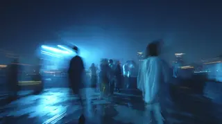
- **Prompt:** `CS · Causal Motion Trigger · POET transitions from the house party to an open-air, intense rooftop club scene · Time-shifted photo-realistic, smooth transition, dynamic camera movement, high energy, pulsating lights, urban rooftop setting, ethereal quality.`
- **In the cuts:**
  - suite: BR (shots from 3 films, no time between them: a category) · Moonwalk One, ca. 1970 (1970); De Joodsche invalide (1939); Mailboot 'Jan Pieterszoon Coen' vertrekt naar In (1922)
  - scenes: SEQ (one film, source order unknown, with an insert) · THE PHOTOGRAPHER (1948); Space Ship Takeoff, a Technical Fantasy (1937); Space Ship Takeoff, a Technical Fantasy (1937)
  - cineosis: BR (shots from 3 films, no time between them: a category) · Master Hands (n.d.); Mental Hospital (1953); Care of the Hair and Nails (1951)
  - drift: BR (shots from 3 films, no time between them: a category) · Fantastic Yellowstone (1997); They Call It All-States (1950); [Amateur film: Medicus collection: New York Worl (1939)

## Midpoint

**Purpose:** A false victory or false defeat; the stakes rise. Here: SH47–SH47, 12:12–12:35, NEWLY SINGLE.

### Syntagma 28 (SY28)
- **Type (intended):** Descriptive Syntagma (DS) [47] · on Metz's table: DESC
- **Purpose:** Mood Environment Stabilizer
- **Read in the cuts:** suite BR · scenes SC · cineosis BR · drift BR
- **Intended type realised:** 0% of shot-by-cut pairs

#### Shot 47 (SH47) · WGY047
- **Content:** The club scene features fast-paced dancing, rapid light flashes, and joyful revelry, all within a time-shifted, surreal atmosphere.
- **Scene:** Fast dancing, flashing lights, people enjoying, time shifted.
- **Angle:** —
- **Duration:** 23.4 s (12:12–12:35, beat 50 · Rooftop club, strobe, shifted time · match 0.6)
- **Movement:** —
- **Function:** Mood Environment Stabilizer · Descriptive Image
- **Her words:** “The soul has escaped my body for the moment and left him on the dance floor. He can now just be / flesh and bones, rejection and heartache hit differently when there are no feelings afloat. / I want my soul now to imagine my body pulsing and head throbbing from the music and empty on”
- **Image:** 
- **Prompt:** `DS · Mood Environment Stabilizer · The club scene features fast-paced dancing, rapid light flashes, and joyful revelry, all within a time-shifted, surreal atmosphere · Time-shifted photo-realistic, motion blur on dancers, strobing lights, euphoric expressions, distorted perception of time, vibrant color palette.`
- **In the cuts:**
  - suite: BR (shots from 3 films, no time between them: a category) · Under Western Stars (n.d.); The Great Train Robbery (1903); Kinderen naar buiten (1935)
  - scenes: SC (one film, no time skipped, with an insert) · Kinderen naar buiten (1935); Kinderen naar buiten (1935); Moonwalk One, ca. 1970 (1970)
  - cineosis: BR (shots from 3 films, no time between them: a category) · Under Western Stars (n.d.); Moonwalk One, ca. 1970 (1970); Beginning to Date (1953)
  - drift: BR (shots from 3 films, no time between them: a category) · This is Russia (Reel 1 of 2) (1957); Moonwalk One, ca. 1970 (1970); Four in the Cosmos (1969)

## Bad Guys Close In

**Purpose:** Pressure from outside and doubt from inside tighten. Here: SH48–SH64, 12:35–16:19, NEWLY SINGLE, YET, HEARD, MAGIC RIDE.

### Syntagma 29 (SY29)
- **Type (intended):** Autonomous Syntagma (AS) [48] · on Metz's table: AS
- **Purpose:** Emotion Relay
- **Read in the cuts:** suite BR · scenes BR · cineosis BR · drift BR
- **Intended type realised:** 0% of shot-by-cut pairs

#### Shot 48 (SH48) · WGY048
- **Content:** POET's soul ascends from their body, floating above the scene.
- **Scene:** POET's soul leaves body, floats above.
- **Angle:** —
- **Duration:** 23.4 s (12:35–12:58, beat 51 · Soul leaves body and watches from above · match 0.8)
- **Movement:** floating
- **Function:** Emotion Relay · Affection-Image
- **Her words:** “I want my soul now to imagine my body pulsing and head throbbing from the music and empty on / a crowded floor of sweated perfumes and temptations. Let's watch strangers collide and spark electric / currents that gamut the mood, a good one. We want him to be the last one to leave, prolonging the / bitter refraction inside the walls of an escape that few pleasures offer us. Now let us put my”
- **Image:** 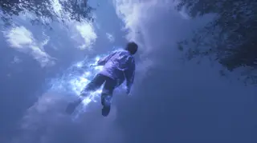
- **Prompt:** `AF · Emotion Relay · POET's soul ascends from their body, floating above the scene · Time-shifted photo-realistic, ethereal, translucent glowing soul, body left below, elevated perspective, sense of out-of-body experience.`
- **In the cuts:**
  - suite: BR (shots from 5 films, no time between them: a category) · Kinderen naar buiten (1935); De graal pinksterzegen (1932); Vertrek mr. B. Fock als gouverneur Nederlands-In (1921); De Joodsche invalide (1939); Friendship Seven (1962)
  - scenes: BR (shots from 3 films, no time between them: a category) · Moonwalk One, ca. 1970 (1970); Moonwalk One, ca. 1970 (1970); Eagle Has Landed: The Flight of Apollo 11 (1969); Eagle Has Landed: The Flight of Apollo 11 (1969); Legacy for Wings (1984)
  - cineosis: BR (shots from 5 films, no time between them: a category) · Beginning to Date (1953); Frigidaire Finale 1957 (1957); Small Steps...Giant Strides (1973); Moonwalk One, ca. 1970 (1970); Who's Out There? (1975)
  - drift: BR (shots from 5 films, no time between them: a category) · Four in the Cosmos (1969); Spider Engineers (1956); Apollo 12: Pinpoint for Science (1969); White Wonder (1958); Indisch allerlei (1920)

### Syntagma 30 (SY30)
- **Type (intended):** Descriptive Syntagma (DS) [49] · on Metz's table: DESC
- **Purpose:** Subjective Frame Recalibration
- **Read in the cuts:** suite BR · scenes BR · cineosis BR · drift BR
- **Intended type realised:** 0% of shot-by-cut pairs

#### Shot 49 (SH49) · WGY049
- **Content:** POET's soul floats high above, observing the entire city of Atlantis illuminated by a network of blue and pink lights.
- **Scene:** POET's soul watches party from above Atlantis, city lit blue/pink.
- **Angle:** aerial, high-angle
- **Duration:** 23.4 s (12:58–13:22, beat 52 · Overhead Atlantis, blue and pink lights · match 0.8)
- **Movement:** —
- **Function:** Subjective Frame Recalibration · Perception-Image
- **Her words:** “bitter refraction inside the walls of an escape that few pleasures offer us. Now let us put my / soul in the middle of an open field at the equator of a planet much larger than my own / and much hotter. Cool me down by pouring unfiltered water out of the ice bath salted from the closest / moons from angels of the newest religions and its joys capturing my body transiting in a flash of / strobe lights. Their gracious cursor blessed me, only infinity will tell. Now bring my soul back”
- **Image:** 
- **Prompt:** `PI · Subjective Frame Recalibration · POET's soul floats high above, observing the entire city of Atlantis illuminated by a network of blue and pink lights · Time-shifted photo-realistic, high-angle aerial view, soul as a luminous point, sprawling cyberpunk city grid, neon blue and pink light dominant, sense of detachment and vastness.`
- **In the cuts:**
  - suite: BR (shots from 4 films, no time between them: a category) · Friendship Seven (1962); ALASKAN EARTHQUAKE (1966); South Dakota Saga (Part II) (1940); Moonwalk One, ca. 1970 (1970)
  - scenes: BR (shots from 2 films, no time between them: a category) · Legacy for Wings (1984); Legacy for Wings (1984); Wording standbeeld van stadhouder Willem III (1921); Wording standbeeld van stadhouder Willem III (1921)
  - cineosis: BR (shots from 4 films, no time between them: a category) · Who's Out There? (1975); SPACE AGE RAILROAD (1969); Naturally - a Girl (1973); Moonwalk One, ca. 1970 (1970)
  - drift: BR (shots from 4 films, no time between them: a category) · Indisch allerlei (1920); Who's Out There? (1975); Assignment: Shoot the Moon (1967); Moonwalk One, ca. 1970 (1970)

### Syntagma 31 (SY31)
- **Type (intended):** Chronological Syntagma (CS) [50–51] · on Metz's table: chronological (SC · SEQ · EP · ALT)
- **Purpose:** Causal Motion Trigger
- **Read in the cuts:** suite BR×2 · scenes BR, EP · cineosis BR×2 · drift BR×2
- **Intended type realised:** 12% of shot-by-cut pairs

#### Shot 50 (SH50) · WGY050
- **Content:** Returning to the club, POET's body is bathed in cleansing water poured by angelic figures amidst the ongoing party.
- **Scene:** Angels dump cleansing water on POET's body in club.
- **Angle:** —
- **Duration:** 15.6 s (13:22–13:37, beat 53 · Angels pour cleansing water over dancing body · match 0.57)
- **Movement:** —
- **Function:** Causal Motion Trigger · Action-Image
- **Her words:** “strobe lights. Their gracious cursor blessed me, only infinity will tell. Now bring my soul back / to my body to lean back, breathe in the smoke that now fills the room and tell myself how good / it is to finally get acquainted with the night, staring into unfamiliar yet relatable mountains”
- **Image:** 
- **Prompt:** `CS · Causal Motion Trigger · Returning to the club, POET's body is bathed in cleansing water poured by angelic figures amidst the ongoing party · Time-shifted photo-realistic, surreal, celestial beings (angels) in glowing form, luminous water, stark contrast between sacred act and mundane club environment.`
- **In the cuts:**
  - suite: BR (shots from 3 films, no time between them: a category) · Master Hands (n.d.); Zuurkoolfabricage (1918); Eagle Has Landed: The Flight of Apollo 11 (1969)
  - scenes: BR (shots from 2 films, no time between them: a category) · Het crematorium Westerveld (1925); Het crematorium Westerveld (1925); Muller en co n.v. Rotterdam (1928)
  - cineosis: BR (shots from 3 films, no time between them: a category) · Fate of the forests, ca. 1980 - ca. 1985 (n.d.); Schedadxw: (pronounced cha-da-duch) (1987); Friendship Seven (1962)
  - drift: BR (shots from 3 films, no time between them: a category) · RESEARCH PROJECT X-15 THE DEVELOPMENT OF THE X-1 (1962); Third Avenue El (n.d.); Your Fire Department (Part I) (1949)

#### Shot 51 (SH51) · WGY051
- **Content:** The club fills with haze as POET's body inhales it, and their soul simultaneously re-enters the body.
- **Scene:** Club fills with haze, POET's body inhales it as soul returns.
- **Angle:** —
- **Duration:** 15.6 s (13:37–13:53, beat 54 · Haze inhaled; soul returns · match 0.75)
- **Movement:** —
- **Function:** Causal Motion Trigger · Action-Image
- **Her words:** “it is to finally get acquainted with the night, staring into unfamiliar yet relatable mountains / in the distance and wandering eyes and wandering thoughts within reach.”
- **Image:** 
- **Prompt:** `CS · Causal Motion Trigger · The club fills with haze as POET's body inhales it, and their soul simultaneously re-enters the body · Time-shifted photo-realistic, mystical, swirling haze, subtle integration of soul returning to body, sense of rejuvenation or re-grounding.`
- **In the cuts:**
  - suite: BR (shots from 2 films, no time between them: a category) · Eagle Has Landed: The Flight of Apollo 11 (1969); Third Avenue El (n.d.)
  - scenes: EP (one film, long organised leaps) · Muller en co n.v. Rotterdam (1928); Muller en co n.v. Rotterdam (1928)
  - cineosis: BR (shots from 2 films, no time between them: a category) · Friendship Seven (1962); The Eagle Has Landed: The Flight of Apollo 11 (1969)
  - drift: BR (shots from 2 films, no time between them: a category) · Your Fire Department (Part I) (1949); [Amateur film: Medicus collection: New York Worl (1939)

### Syntagma 32 (SY32)
- **Type (intended):** Descriptive Syntagma (DS) [52] · on Metz's table: DESC
- **Purpose:** Subjective Frame Recalibration
- **Read in the cuts:** suite BR · scenes SEQ · cineosis BR · drift BR
- **Intended type realised:** 0% of shot-by-cut pairs

#### Shot 52 (SH52) · WGY052
- **Content:** From the rooftop, POET gazes intently at distant mountains.
- **Scene:** POET stares into mountains from rooftop.
- **Angle:** wide shot
- **Duration:** 14.1 s (13:53–14:07, beat 55 · Rooftop gaze toward distant mountains · match 0.8)
- **Movement:** —
- **Function:** Subjective Frame Recalibration · Perception-Image
- **Her words:** “Accepting you'll never say nor ever feel, my love was real. / What isn't mine I still cannot give. / I gather my things to go.”
- **Image:** 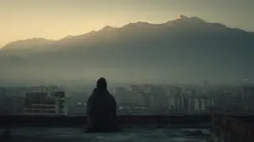
- **Prompt:** `PI · Subjective Frame Recalibration · From the rooftop, POET gazes intently at distant mountains · Photo-realistic, contemplative, wide shot of city stretching to mountains, serene but slightly melancholic mood, dramatic lighting on mountains (dawn or dusk).`
- **In the cuts:**
  - suite: BR (shots from 2 films, no time between them: a category) · Schedadxw: (pronounced cha-da-duch) (1987); Delft (1923)
  - scenes: SEQ (one film, moments skipped) · Duck and Cover (1951); Duck and Cover (1951)
  - cineosis: BR (shots from 2 films, no time between them: a category) · Moonwalk One, ca. 1970 (1970); 'Till It Helps! (1959)
  - drift: BR (shots from 2 films, no time between them: a category) · Friendship Seven (1962); Space Shuttle: A Remarkable Flying Machine (1981)

### Syntagma 33 (SY33)
- **Type (intended):** Chronological Syntagma (CS) [53] · on Metz's table: chronological (SC · SEQ · EP · ALT)
- **Purpose:** Causal Motion Trigger
- **Read in the cuts:** suite BR · scenes BR · cineosis BR · drift BR
- **Intended type realised:** 0% of shot-by-cut pairs

#### Shot 53 (SH53) · WGY053
- **Content:** POET exits the club and walks down a city street, drawing admiration from crowds of men and women.
- **Scene:** POET leaves club, walks street, crowds fawn over.
- **Angle:** —
- **Duration:** 4.7 s (14:07–14:12, beat 56 · Crowds admire Poet; Ex appears and is unreachable · match 0.4)
- **Movement:** —
- **Function:** Causal Motion Trigger · Action-Image
- **Her words:** “I gather my things to go. / Before I go, we look at the moon the way we used to see it”
- **Image:** 
- **Prompt:** `CS · Causal Motion Trigger · POET exits the club and walks down a city street, drawing admiration from crowds of men and women · Photo-realistic, confident stride, crowds parting or looking admiringly, urban street scene, vibrant city lights, sense of celebrity or charisma.`
- **In the cuts:**
  - suite: BR (shots from 2 films, no time between them: a category) · Delft (1923); Garden Wise (Pt 1) (n.d.)
  - scenes: BR (shots from 2 films, no time between them: a category) · Duck and Cover (1951); Moonwalk One, ca. 1970 (1970)
  - cineosis: BR (shots from 2 films, no time between them: a category) · 'Till It Helps! (1959); Garden Wise (Pt 1) (n.d.)
  - drift: BR (shots from 2 films, no time between them: a category) · Space Shuttle: A Remarkable Flying Machine (1981); Space Flight: Application of Orbital Mechanics (1994)

### Syntagma 34 (SY34)
- **Type (intended):** Autonomous Syntagma (AS) [54] · on Metz's table: AS
- **Purpose:** Emotion Relay
- **Read in the cuts:** suite BR · scenes BR · cineosis BR · drift BR
- **Intended type realised:** 0% of shot-by-cut pairs

#### Shot 54 (SH54) · WGY054
- **Content:** POET spots EX (still only from the back) in the crowd and attempts to reach them, but is unable to.
- **Scene:** POET sees EX in crowd, tries to reach, fails.
- **Angle:** —
- **Duration:** 4.7 s (14:12–14:16, beat 56 · Crowds admire Poet; Ex appears and is unreachable · match 0.4)
- **Movement:** —
- **Function:** Emotion Relay · Affection-Image
- **Her words:** “Before I go, we look at the moon the way we used to see it / and settle down the stillnessism. / We talk for years and travel through time”
- **Image:** 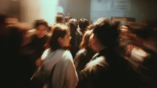
- **Prompt:** `AF · Emotion Relay · POET spots EX (still only from the back) in the crowd and attempts to reach them, but is unable to · Photo-realistic, sense of longing and frustration, crowd as an obstacle, EX remaining elusive, emotional distance despite physical proximity.`
- **In the cuts:**
  - suite: BR (shots from 2 films, no time between them: a category) · Delft (1923); Garden Wise (Pt 1) (n.d.)
  - scenes: BR (shots from 2 films, no time between them: a category) · Duck and Cover (1951); Moonwalk One, ca. 1970 (1970)
  - cineosis: BR (shots from 2 films, no time between them: a category) · 'Till It Helps! (1959); Garden Wise (Pt 1) (n.d.)
  - drift: BR (shots from 2 films, no time between them: a category) · Space Shuttle: A Remarkable Flying Machine (1981); Space Flight: Application of Orbital Mechanics (1994)

### Syntagma 35 (SY35)
- **Type (intended):** Chronological Syntagma (CS) [55] · on Metz's table: chronological (SC · SEQ · EP · ALT)
- **Purpose:** Causal Motion Trigger
- **Read in the cuts:** suite BR · scenes SEQ · cineosis BR · drift BR
- **Intended type realised:** 25% of shot-by-cut pairs

#### Shot 55 (SH55) · WGY055
- **Content:** POET and EX walk side-by-side down an Atlantis street, engaged in conversation, with the moon visible in the distance.
- **Scene:** POET and EX walk Atlantis street, talking, moon distant.
- **Angle:** —
- **Duration:** 9.4 s (14:16–14:26, beat 57 · Poet and Ex walk under the moon · match 0.75)
- **Movement:** —
- **Function:** Causal Motion Trigger · Action-Image
- **Her words:** “We talk for years and travel through time / and it feels so good. / We grow old together. / I believe maybe we could have it all, / or swing in my humbled late nights and heartbreaks”
- **Image:** 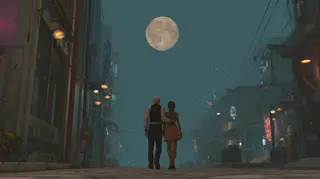
- **Prompt:** `CS · Causal Motion Trigger · POET and EX walk side-by-side down an Atlantis street, engaged in conversation, with the moon visible in the distance · Photo-realistic cyberpunk, intimate, shared moment, city lights as backdrop, large moon in sky, sense of connection.`
- **In the cuts:**
  - suite: BR (shots from 2 films, no time between them: a category) · Garden Wise (Pt 1) (n.d.); Moonwalk One, ca. 1970 (1970)
  - scenes: SEQ (one film, source order unknown) · Moonwalk One, ca. 1970 (1970); Moonwalk One, ca. 1970 (1970)
  - cineosis: BR (shots from 2 films, no time between them: a category) · Garden Wise (Pt 1) (n.d.); Big Train, The (Part I) (1950)
  - drift: BR (shots from 2 films, no time between them: a category) · Space Flight: Application of Orbital Mechanics (1994); Mirror of America (1963)

### Syntagma 36 (SY36)
- **Type (intended):** Descriptive Syntagma (DS) [56] · on Metz's table: DESC
- **Purpose:** Mood Environment Stabilizer
- **Read in the cuts:** suite BR · scenes BR · cineosis BR · drift BR
- **Intended type realised:** 0% of shot-by-cut pairs

#### Shot 56 (SH56) · WGY056
- **Content:** EX and POET stand on a sidewalk beside a phone booth, suitcases at their feet.
- **Scene:** EX and POET stand near phone booth with suitcases.
- **Angle:** —
- **Duration:** 7.1 s (14:26–14:33, beat 58 · Suitcases, phone booth, call to Mother · match 0.6)
- **Movement:** —
- **Function:** Mood Environment Stabilizer · Descriptive Image
- **Her words:** “or swing in my humbled late nights and heartbreaks / and an end story unchanging. / You help me gather my things to go.”
- **Image:** 
- **Prompt:** `DS · Mood Environment Stabilizer · EX and POET stand on a sidewalk beside a phone booth, suitcases at their feet · Photo-realistic, urban, subtle tension, packed suitcases suggesting travel or departure, classic phone booth as a prop.`
- **In the cuts:**
  - suite: BR (shots from 2 films, no time between them: a category) · Moonwalk One, ca. 1970 (1970); Town and the Telephone, The (1950)
  - scenes: BR (shots from 2 films, no time between them: a category) · Moonwalk One, ca. 1970 (1970); All My Babies (1953)
  - cineosis: BR (shots from 2 films, no time between them: a category) · Big Train, The (Part I) (1950); Sound And The Story (1956)
  - drift: BR (shots from 2 films, no time between them: a category) · Mirror of America (1963); Alice In Wonderland (1915)

### Syntagma 37 (SY37)
- **Type (intended):** Chronological Syntagma (CS) [57] · on Metz's table: chronological (SC · SEQ · EP · ALT)
- **Purpose:** Causal Motion Trigger
- **Read in the cuts:** suite BR · scenes BR · cineosis BR · drift BR
- **Intended type realised:** 0% of shot-by-cut pairs

#### Shot 57 (SH57) · WGY057
- **Content:** POET enters a phone booth to make a call to MOTHER.
- **Scene:** POET calls MOTHER from phone booth.
- **Angle:** —
- **Duration:** 7.1 s (14:33–14:40, beat 58 · Suitcases, phone booth, call to Mother · match 0.8)
- **Movement:** —
- **Function:** Causal Motion Trigger · Action-Image
- **Her words:** “You help me gather my things to go. / Before I go, I call on my mother. / In tears, speaking of an abyss, she's never known.”
- **Image:** 
- **Prompt:** `CS · Causal Motion Trigger · POET enters a phone booth to make a call to MOTHER · Photo-realistic, intimate, focus on POET's face in the phone booth, glowing phone booth, sense of vulnerability.`
- **In the cuts:**
  - suite: BR (shots from 2 films, no time between them: a category) · Moonwalk One, ca. 1970 (1970); Town and the Telephone, The (1950)
  - scenes: BR (shots from 2 films, no time between them: a category) · Moonwalk One, ca. 1970 (1970); All My Babies (1953)
  - cineosis: BR (shots from 2 films, no time between them: a category) · Big Train, The (Part I) (1950); Sound And The Story (1956)
  - drift: BR (shots from 2 films, no time between them: a category) · Mirror of America (1963); Alice In Wonderland (1915)

### Syntagma 38 (SY38)
- **Type (intended):** Flashback Syntagma [58–59] · on Metz's table: not in Metz's table (an insert or alternate flashback)
- **Purpose:** Memory Storage Retrieval
- **Read in the cuts:** suite BR×2 · scenes SEQ×2 · cineosis BR×2 · drift BR×2
- **Intended type realised:** 0% of shot-by-cut pairs

#### Shot 58 (SH58) · WGY058
- **Content:** POET and MOTHER engage in conversation while observing POET and EX's breakup unfolding in the background on the sidewalk.
- **Scene:** POET and MOTHER talk, watching POET and EX break up in background.
- **Angle:** —
- **Duration:** 18.8 s (14:40–14:59, beat 59 · Mother and Poet watch Poet and Ex break up · match 0.75)
- **Movement:** —
- **Function:** Memory Storage Retrieval · Recollection-Image
- **Her words:** “In tears, speaking of an abyss, she's never known. / And we talk for years and we closet wounds / and we explain my way of birth then and even after prayer. / What isn't mine I still cannot give. / We grow old together with the moon looking at us / the way we used to be.”
- **Image:** 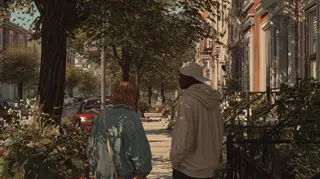
- **Prompt:** `RI · Memory Storage Retrieval · POET and MOTHER engage in conversation while observing POET and EX's breakup unfolding in the background on the sidewalk · Photo-realistic, layered scene, foreground intimacy, background drama (EX still facing away), subtle emotional interplay, sense of meta-observation.`
- **In the cuts:**
  - suite: BR (shots from 4 films, no time between them: a category) · Town and the Telephone, The (1950); They Call It All-States (1950); Duck and Cover (1951); Manhattan Waterfront (n.d.)
  - scenes: SEQ (one film, moments skipped, with an insert) · All My Babies (1953); All My Babies (1953); All My Babies (1953); Muller en co n.v. Rotterdam (1928)
  - cineosis: BR (shots from 4 films, no time between them: a category) · Sound And The Story (1956); Moonwalk One, ca. 1970 (1970); WJR: One of a Kind (1966); Court to Court (October 2004) (2004)
  - drift: BR (shots from 4 films, no time between them: a category) · Alice In Wonderland (1915); All My Babies (1953); Eat for Health (1954); Have I Told You Lately That I Love You? (1958)

#### Shot 59 (SH59) · WGY059
- **Content:** A cut to a living room shows POET and MOTHER talking, with the POET and EX breakup visibly in the background.
- **Scene:** POET and MOTHER in living room talk, POET and EX break up in background.
- **Angle:** —
- **Duration:** 18.8 s (14:59–15:18, beat 60 · Street becomes living room; breakup remains · match 0.5)
- **Movement:** —
- **Function:** Memory Storage Retrieval · Recollection-Image
- **Her words:** “As my tears fall between the creases and faith, / dancing on my own, maternal ears in tune. / She watches us gather my things to go. / Before I go, I call on my father. / Summon his calming demeanor from the yonders / and we walk for years and travel east toward the sunrises”
- **Image:** 
- **Prompt:** `RI · Memory Storage Retrieval · A cut to a living room shows POET and MOTHER talking, with the POET and EX breakup visibly in the background · Photo-realistic, domestic setting, soft interior light, background as a window or framed picture, dreamlike or memory-like quality for the background scene, emotional intensity.`
- **In the cuts:**
  - suite: BR (shots from 3 films, no time between them: a category) · Manhattan Waterfront (n.d.); Dordrecht (1926); Boy in Court (1940)
  - scenes: SEQ (one film, moments skipped, with an insert) · Muller en co n.v. Rotterdam (1928); Muller en co n.v. Rotterdam (1928); Gardening (1940)
  - cineosis: BR (shots from 3 films, no time between them: a category) · Court to Court (October 2004) (2004); Big Train, The (Part II) (1950); No Time for Ugliness (Part I) (1965)
  - drift: BR (shots from 3 films, no time between them: a category) · Have I Told You Lately That I Love You? (1958); Bosque del Apache National Wildlife Refuge (2005); South Dakota Saga (Part II) (1940)

### Syntagma 39 (SY39)
- **Type (intended):** Chronological Syntagma (CS) [60–61] · on Metz's table: chronological (SC · SEQ · EP · ALT)
- **Purpose:** Causal Motion Trigger
- **Read in the cuts:** suite BR×2 · scenes SEQ×2 · cineosis BR×2 · drift BR×2
- **Intended type realised:** 25% of shot-by-cut pairs

#### Shot 60 (SH60) · WGY060
- **Content:** POET ends the call, and MOTHER subtly fades away.
- **Scene:** POET hangs up, MOTHER disappears.
- **Angle:** —
- **Duration:** 7.1 s (15:18–15:25, beat 61 · Mother disappears; Father answers and appears · match 0.4)
- **Movement:** —
- **Function:** Causal Motion Trigger · Action-Image
- **Her words:** “and we walk for years and travel east toward the sunrises / and retrace his footsteps now and then.”
- **Image:** 
- **Prompt:** `CS · Causal Motion Trigger · POET ends the call, and MOTHER subtly fades away · Photo-realistic, quiet, tender moment, MOTHER's figure dissolving into light or mist, sense of transition or farewell.`
- **In the cuts:**
  - suite: BR (shots from 2 films, no time between them: a category) · Boy in Court (1940); Duck and Cover (1951)
  - scenes: SEQ (one film, source order unknown) · Gardening (1940); Gardening (1940)
  - cineosis: BR (shots from 2 films, no time between them: a category) · No Time for Ugliness (Part I) (1965); Visibility and Communications: Off-Road and High (2004)
  - drift: BR (shots from 2 films, no time between them: a category) · South Dakota Saga (Part II) (1940); Alaska's Silver Millions (Part II) (1936)

#### Shot 61 (SH61) · WGY061
- **Content:** POET calls FATHER, who materializes and observes POET and EX's breakup on the sidewalk.
- **Scene:** POET calls FATHER, FATHER appears, watches breakup.
- **Angle:** —
- **Duration:** 7.1 s (15:25–15:32, beat 61 · Mother disappears; Father answers and appears · match 0.4)
- **Movement:** —
- **Function:** Causal Motion Trigger · Action-Image
- **Her words:** “and retrace his footsteps now and then. / Guiding a settling down moon the way it used to leave / and my tears fall between the creases”
- **Image:** 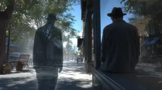
- **Prompt:** `CS · Causal Motion Trigger · POET calls FATHER, who materializes and observes POET and EX's breakup on the sidewalk · Photo-realistic, surreal, FATHER appearing as solid, supportive presence, contrasting with the background drama, subtle lighting to distinguish layers.`
- **In the cuts:**
  - suite: BR (shots from 2 films, no time between them: a category) · Boy in Court (1940); Duck and Cover (1951)
  - scenes: SEQ (one film, source order unknown) · Gardening (1940); Gardening (1940)
  - cineosis: BR (shots from 2 films, no time between them: a category) · No Time for Ugliness (Part I) (1965); Visibility and Communications: Off-Road and High (2004)
  - drift: BR (shots from 2 films, no time between them: a category) · South Dakota Saga (Part II) (1940); Alaska's Silver Millions (Part II) (1936)

### Syntagma 40 (SY40)
- **Type (intended):** Flashback Syntagma [62] · on Metz's table: not in Metz's table (an insert or alternate flashback)
- **Purpose:** Memory Storage Retrieval
- **Read in the cuts:** suite BR · scenes SEQ · cineosis BR · drift BR
- **Intended type realised:** 0% of shot-by-cut pairs

#### Shot 62 (SH62) · WGY062
- **Content:** POET and FATHER walk down paths, their journey overlaid with the lingering image of POET and EX's breakup in the background.
- **Scene:** POET and FATHER walk paths, POET and EX break up in background.
- **Angle:** —
- **Duration:** 18.8 s (15:32–15:50, beat 62 · Father and son walk while breakup persists · match 0.5)
- **Movement:** —
- **Function:** Memory Storage Retrieval · Recollection-Image
- **Her words:** “and my tears fall between the creases / and wave shadows of the inner harbor. / We stroll, father and son, hearted and shaken. / Someone borrowed and someone blew. / Yet broken, yet hurt.”
- **Image:** 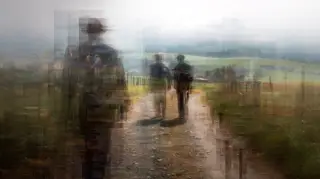
- **Prompt:** `RI · Memory Storage Retrieval · POET and FATHER walk down paths, their journey overlaid with the lingering image of POET and EX's breakup in the background · Photo-realistic, dreamlike, foreground motion, background as a blurred or desaturated memory, sense of moving forward while processing the past.`
- **In the cuts:**
  - suite: BR (shots from 3 films, no time between them: a category) · Duck and Cover (1951); Stadsuitbreidingen Den Haag (1925); Zaandam (1921)
  - scenes: SEQ (one film, moments skipped, with an insert) · Gardening (1940); ALASKAN EARTHQUAKE (1966); ALASKAN EARTHQUAKE (1966)
  - cineosis: BR (shots from 3 films, no time between them: a category) · Visibility and Communications: Off-Road and High (2004); Amateur Film European Trip 1930s (Part II) (n.d.); Amateur Film European Trip 1930s (Part I) (n.d.)
  - drift: BR (shots from 3 films, no time between them: a category) · Alaska's Silver Millions (Part II) (1936); Story of Jewel City, The (1915); Valley Town (1940)

### Syntagma 41 (SY41)
- **Type (intended):** Chronological Syntagma (CS) [63] · on Metz's table: chronological (SC · SEQ · EP · ALT)
- **Purpose:** Causal Motion Trigger
- **Read in the cuts:** suite BR · scenes SEQ · cineosis BR · drift BR
- **Intended type realised:** 25% of shot-by-cut pairs

#### Shot 63 (SH63) · WGY063
- **Content:** Back on the sidewalk, EX transforms into a hazy mist and dissipates.
- **Scene:** POET and EX on sidewalk, EX turns to haze, disappears.
- **Angle:** —
- **Duration:** 14.1 s (15:50–16:05, beat 63 · Ex dissolves into haze · match 0.5)
- **Movement:** —
- **Function:** Causal Motion Trigger · Action-Image
- **Her words:** “I wasn't looking for a ride, but here you are, blissful and oddly sensitive, / withering a soul purveying both the dark and the light worlds I've known.”
- **Image:** 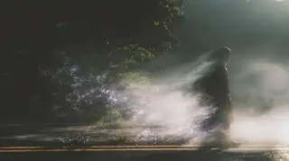
- **Prompt:** `CS · Causal Motion Trigger · Back on the sidewalk, EX transforms into a hazy mist and dissipates · Photo-realistic, melancholic, surreal, EX's figure dissolving into shimmering haze, sense of final farewell and acceptance.`
- **In the cuts:**
  - suite: BR (shots from 2 films, no time between them: a category) · Industries of the United States: Steel - The Har (n.d.); Master Hands (n.d.)
  - scenes: SEQ (one film, source order unknown) · JFK EXHIBIT 3: RECONSTRUCTION FILM (1943); JFK EXHIBIT 3: RECONSTRUCTION FILM (1943)
  - cineosis: BR (shots from 2 films, no time between them: a category) · Let's Go To The Movies (1948); Amateur Film New Jersey B (n.d.)
  - drift: BR (shots from 2 films, no time between them: a category) · South Chile (1945); Belo Horizonte (1949)

### Syntagma 42 (SY42)
- **Type (intended):** Descriptive Syntagma (DS) [64] · on Metz's table: DESC
- **Purpose:** Mood Environment Stabilizer
- **Read in the cuts:** suite BR · scenes SEQ · cineosis BR · drift BR
- **Intended type realised:** 0% of shot-by-cut pairs

#### Shot 64 (SH64) · WGY064
- **Content:** POET stands alone on the sidewalk, turning to examine a parked motorcycle.
- **Scene:** POET stands alone, inspects motorcycle.
- **Angle:** —
- **Duration:** 14.1 s (16:05–16:19, beat 64 · Poet touches steel and mounts motorcycle · match 0.4)
- **Movement:** —
- **Function:** Mood Environment Stabilizer · Descriptive Image
- **Her words:** “withering a soul purveying both the dark and the light worlds I've known. / So I rub my aggressions into your steel coverings and hop on to amuse myself. / Loneliness is having everything with no one to tell,”
- **Image:** 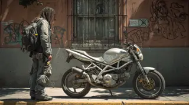
- **Prompt:** `DS · Mood Environment Stabilizer · POET stands alone on the sidewalk, turning to examine a parked motorcycle · Photo-realistic, moment of solitude, urban backdrop (Mexico City), focus on POET's posture and the details of the motorcycle, reflective surfaces.`
- **In the cuts:**
  - suite: BR (shots from 3 films, no time between them: a category) · Master Hands (n.d.); Your Permit to Drive (1951); Speaking of Rubber (Part II) (1951)
  - scenes: SEQ (one film, moments skipped, with an insert) · JFK EXHIBIT 3: RECONSTRUCTION FILM (1943); SPACE AGE RAILROAD (1969); SPACE AGE RAILROAD (1969)
  - cineosis: BR (shots from 3 films, no time between them: a category) · Amateur Film New Jersey B (n.d.); NASA Searches for Life from the Moon in Recently (1969); Moonwalk One, ca. 1970 (1970)
  - drift: BR (shots from 3 films, no time between them: a category) · Belo Horizonte (1949); Brooklyn Goes to San Francisco (1947); Singing Wheels (n.d.)

## All Is Lost

**Purpose:** The lowest point; something dies. Here: SH65–SH65, 16:19–16:47, MAGIC RIDE.

### Syntagma 43 (SY43)
- **Type (intended):** Chronological Syntagma (CS) [65] · on Metz's table: chronological (SC · SEQ · EP · ALT)
- **Purpose:** Causal Motion Trigger
- **Read in the cuts:** suite BR · scenes BR · cineosis BR · drift BR
- **Intended type realised:** 0% of shot-by-cut pairs

#### Shot 65 (SH65) · WGY065
- **Content:** POET mounts the motorcycle and speeds through the streets of Atlantis, a blur of buildings, vehicles, and lights flashing past.
- **Scene:** POET rides motorcycle through Atlantis streets, buildings, lights fly by.
- **Angle:** pov
- **Duration:** 28.2 s (16:19–16:47, beat 65 · Ride through Atlantis, buildings and lights streak · match 0.83)
- **Movement:** dynamic
- **Function:** Causal Motion Trigger · Action-Image
- **Her words:** “Loneliness is having everything with no one to tell, / being everywhere with no one to love and escape, / wide-eyed and stone but alive and well, wandering with no clear end. / I let the noise block the noise so the way I ride through the streets with the swag and eyes turn, / has twists, improve, yeah, the magic still exists. / All preparations to live and dream in darkness I no longer desire.”
- **Image:** 
- **Prompt:** `CS · Causal Motion Trigger · POET mounts the motorcycle and speeds through the streets of Atlantis, a blur of buildings, vehicles, and lights flashing past · Photo-realistic cyberpunk, dynamic motion, speed lines, light streaks, neon glow, immersive POV, sense of liberation.`
- **In the cuts:**
  - suite: BR (shots from 4 films, no time between them: a category) · Speaking of Rubber (Part II) (1951); AUTOMOBILE ECONOMY TEST, ca. 1938 (n.d.); Cancer (n.d.); San Francisco Earthquake Aftermath, Part 1 (1906)
  - scenes: BR (shots from 3 films, no time between them: a category) · SPACE AGE RAILROAD (1969); Moonwalk One, ca. 1970 (1970); Moonwalk One, ca. 1970 (1970); House of the woods: A forest trilogy (1983)
  - cineosis: BR (shots from 4 films, no time between them: a category) · Moonwalk One, ca. 1970 (1970); SPACE AGE RAILROAD (1969); Dusk to Dawn (1971); Uncle Walt (1964)
  - drift: BR (shots from 4 films, no time between them: a category) · Singing Wheels (n.d.); Air Show in Paris (1971); Space Ship Takeoff, a Technical Fantasy (1937); THE PHOTOGRAPHER (1948)

## Dark Night of the Soul

**Purpose:** The hero sits with the loss. Here: SH66–SH67, 16:54–17:36, MAGIC RIDE.

### Syntagma 44 (SY44)
- **Type (intended):** Chronological Syntagma (CS) [66–67] · on Metz's table: chronological (SC · SEQ · EP · ALT)
- **Purpose:** Causal Motion Trigger
- **Read in the cuts:** suite BR×2 · scenes BR×2 · cineosis BR×2 · drift BR×2
- **Intended type realised:** 0% of shot-by-cut pairs

#### Shot 66 (SH66) · WGY066
- **Content:** POET exits Atlantis as night transitions to dusk, the sky gradually lightening.
- **Scene:** POET rides out of Atlantis as night turns to dusk.
- **Angle:** —
- **Duration:** 14.1 s (16:54–17:08, beat 67 · Leave city as night lightens · match 0.25)
- **Movement:** —
- **Function:** Causal Motion Trigger · Action-Image
- **Her words:** “and I can see a morning ahead for me. / It looks like a morning I could believe in, / a morning where loss and life aren't so well, ripe with sunlight that's deceptively warm. / The tripping of birds, feeling of nests, spring out of the night that has covered me,”
- **Image:** 
- **Prompt:** `CS · Causal Motion Trigger · POET exits Atlantis as night transitions to dusk, the sky gradually lightening · Photo-realistic cyberpunk, gradual change in lighting, city fading in the background, horizon with warm, soft colors of dusk, sense of transition.`
- **In the cuts:**
  - suite: BR (shots from 2 films, no time between them: a category) · South Chile (1945); Show 'Em the Road (Part II) (1954)
  - scenes: BR (shots from 2 films, no time between them: a category) · House of the woods: A forest trilogy (1983); Scatter radar: Space research from the ground (1963)
  - cineosis: BR (shots from 2 films, no time between them: a category) · EMAP: America's Ecological Report Card (1991); Big Train, The (Part II) (1950)
  - drift: BR (shots from 2 films, no time between them: a category) · Ant City (1949); AUTOMOBILE ECONOMY TEST, ca. 1938 (n.d.)

#### Shot 67 (SH67) · WGY067
- **Content:** POET rides through the surrounding mountains of Atlantis during the twilight hours.
- **Scene:** POET rides through mountains around Atlantis at dusk.
- **Angle:** —
- **Duration:** 28.2 s (17:08–17:36, beat 68 · Mountain ride, birds and first light · match 0.4)
- **Movement:** pan
- **Function:** Causal Motion Trigger · Action-Image
- **Her words:** “The tripping of birds, feeling of nests, spring out of the night that has covered me, / with my own curiosities for a chance at an end, where everything will be okay. / I want to live in this feeling forever, blissful and oddly innocent, / riding in a way you can't help but double-click, / improve, yeah, the magic still exists.”
- **Image:** 
- **Prompt:** `CS · Causal Motion Trigger · POET rides through the surrounding mountains of Atlantis during the twilight hours · Photo-realistic cyberpunk, sweeping mountain vistas, soft lighting, remnants of city lights in the distance, sense of expansive journey.`
- **In the cuts:**
  - suite: BR (shots from 4 films, no time between them: a category) · Show 'Em the Road (Part II) (1954); Scatter radar: Space research from the ground (1963); Indisch allerlei (1920); SPACE AGE RAILROAD (1969)
  - scenes: BR (shots from 2 films, no time between them: a category) · Scatter radar: Space research from the ground (1963); Scatter radar: Space research from the ground (1963); This Is My Railroad (Part II) (1940); This Is My Railroad (Part II) (1940)
  - cineosis: BR (shots from 4 films, no time between them: a category) · Big Train, The (Part II) (1950); [Amateur film: "Saga of the Happy Wanderers"] (1957); Moonwalk One, ca. 1970 (1970); Show 'Em the Road (Part II) (1954)
  - drift: BR (shots from 4 films, no time between them: a category) · AUTOMOBILE ECONOMY TEST, ca. 1938 (n.d.); BEHIND THE GREAT SEAL TOO, ca. 1938 (n.d.); [Amateur films: Ivan Besse collection: Britton,  (1938); South Chile (1945)

# Act 3 (A3): Resolution

**Purpose:** What comes back, and what is left behind. On the clock 18:32–24:00, across: NEW DAY, REUNION, HOW TO WIN MY HEART, HOT MINUTE.

## Break into Three

**Purpose:** The answer arrives, drawn from A and B stories together. Here: SH68–SH68, 18:11–18:46, NEW DAY.

### Syntagma 45 (SY45)
- **Type (intended):** Chronological Syntagma (CS) [68] · on Metz's table: chronological (SC · SEQ · EP · ALT)
- **Purpose:** Causal Motion Trigger
- **Read in the cuts:** suite BR · scenes BR · cineosis BR · drift BR
- **Intended type realised:** 0% of shot-by-cut pairs

#### Shot 68 (SH68) · WGY068
- **Content:** POET returns to the decaying chapel shore and begins to rebuild a new, futuristic, modern, clean, and white temple, which constructs itself in unison with POET's actions.
- **Scene:** POET rides to shore, rebuilds new, futuristic temple.
- **Angle:** —
- **Duration:** 34.8 s (18:11–18:46, beat 71 · Modern white temple builds with Poet · match 0.8)
- **Movement:** —
- **Function:** Causal Motion Trigger · Action-Image
- **Her words:** “to emit jazz tuned lyrics that heat and dry the morning dew. / All the remnants of the destruction revealed in the sunlight. / We can rebuild this temple. / It's a new day. / The catharsis evoked by loss in the painful crawl / along the cobblestone boulevards of broken dreams. / I can close a chapter and open a journal stored away / from moments of great clarity. / Words written from life's triumphs to offer a blueprint / of keeping faith alive and as majestic. / When words are read aloud and sung alone as gospels”
- **Image:** 
- **Prompt:** `CS · Causal Motion Trigger · POET returns to the decaying chapel shore and begins to rebuild a new, futuristic, modern, clean, and white temple, which constructs itself in unison with POET's actions · Photo-realistic, transformative, old ruins transforming into sleek futuristic architecture, white and luminous materials, subtle golden light, sense of creation and renewal.`
- **In the cuts:**
  - suite: BR (shots from 5 films, no time between them: a category) · Alice In Wonderland (1915); Moonwalk One, ca. 1970 (1970); Another Suburban Sky - May 2007 Another Suburban (2007); Powering One Corner of the World (1987); Taiwan (1960)
  - scenes: BR (shots from 3 films, no time between them: a category) · Wording standbeeld van stadhouder Willem III (1921); De Joodsche invalide (1939); De Joodsche invalide (1939); House of the woods: A forest trilogy (1983); House of the woods: A forest trilogy (1983)
  - cineosis: BR (shots from 5 films, no time between them: a category) · Amateur Film European Trip 1930s (Part II) (n.d.); De Joodsche invalide (1939); No Time for Ugliness (Part I) (1965); Century of Progress Exposition: Wings of a Centu (1933); World of Tomorrow, The (Part II) (n.d.)
  - drift: BR (shots from 5 films, no time between them: a category) · Aluminum on the March (Part II) (1956); [Amateur film: Golden Gate Bridge] (1939); Schedadxw: (pronounced cha-da-duch) (1987); Apollo 13 Splashdown and Recovery (1970); Friendship Seven (1962)

## Finale

**Purpose:** The hero acts on what was learned; the world is remade. Here: SH69–SH87, 19:00–23:52, NEW DAY, REUNION, HOW TO WIN MY HEART, HOT MINUTE.

### Syntagma 46 (SY46)
- **Type (intended):** Chronological Syntagma (CS) [69] · on Metz's table: chronological (SC · SEQ · EP · ALT)
- **Purpose:** Causal Motion Trigger
- **Read in the cuts:** suite BR · scenes SEQ · cineosis BR · drift BR
- **Intended type realised:** 25% of shot-by-cut pairs

#### Shot 69 (SH69) · WGY069
- **Content:** POET hosts friends and events in the newly built, futuristic temple.
- **Scene:** POET hosts friends and events in new temple.
- **Angle:** —
- **Duration:** 27.8 s (19:00–19:28, beat 73 · Completed temple and Poet in sunlight · match 0.5)
- **Movement:** —
- **Function:** Causal Motion Trigger · Action-Image
- **Her words:** “We can receive a new day. / We can welcome a new day. / Everything I've known and learned, / every circumference of life we're celebrating and believing / is here together in this sacred place, / reveling in the sunlight of a new beginning / with this world and a heart at peace.”
- **Image:** 
- **Prompt:** `CS · Causal Motion Trigger · POET hosts friends and events in the newly built, futuristic temple · Photo-realistic, vibrant, modern white temple interior, diverse group of friends, laughter, warm and inviting lighting, sense of community and joy, subtle futuristic elements in design.`
- **In the cuts:**
  - suite: BR (shots from 3 films, no time between them: a category) · Middle America (1953); No Time for Ugliness (Part I) (1965); St. John Virgin Islands National park (1990)
  - scenes: SEQ (one film, source order unknown, with an insert) · Garden Wise (Pt 1) (n.d.); [Amateur film: Medicus collection: New York Worl (1939); [Amateur film: Medicus collection: New York Worl (1939)
  - cineosis: BR (shots from 3 films, no time between them: a category) · New York Water Supply (1927); All My Babies (1953); California Picture Book (1946)
  - drift: BR (shots from 3 films, no time between them: a category) · Forestry and Forest Industries (1946); Visions of the wild (1985); Japan (1960)

### Syntagma 47 (SY47)
- **Type (intended):** Thematic Montage (TM) [70] · on Metz's table: achronological (PAR · BR)
- **Purpose:** Memory Storage Retrieval
- **Read in the cuts:** suite BR · scenes BR · cineosis BR · drift BR
- **Intended type realised:** 100% of shot-by-cut pairs

#### Shot 70 (SH70) · WGY070
- **Content:** Archival photos of past friends and events are reenacted within the new, futuristic temple setting.
- **Scene:** Archival photos reenacted in new temple.
- **Angle:** —
- **Duration:** 37.5 s (19:28–20:05, beat 74 · Friends embrace, laugh and share memories · match 0.2)
- **Movement:** —
- **Function:** Memory Storage Retrieval · Thematic Montage
- **Her words:** “Decades later, there was less time for words and more space for laughter, hugs with no reason, / loud voices so our hearts can be overheard. My mind drifts into the darkness of our afterlives, / and those rooms are empty. We are all here, each holding our glasses of burning sands / and known journeys, and grateful to every living tree in the forest for the shared years / and the shared memories. This is brotherhood. Smiles with no reason,”
- **Image:** 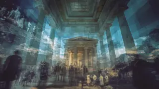
- **Prompt:** `TM · Memory Storage Retrieval · Archival photos of past friends and events are reenacted within the new, futuristic temple setting · Photo-realistic, split-screen or overlay showing old, slightly desaturated photos alongside vibrant, modern reenactments, creating a nostalgic yet forward-looking aesthetic, sense of continuity.`
- **In the cuts:**
  - suite: BR (shots from 5 films, no time between them: a category) · Under Western Stars (n.d.); Kinderen naar buiten (1935); Uitstapje naar de Kager-plassen (1922); Opening tramlijn naar Wassenaar (1923); Stemmen verkiezingen (1922)
  - scenes: BR (shots from 3 films, no time between them: a category) · All My Babies (1953); All My Babies (1953); Duck and Cover (1951); Duck and Cover (1951); American Frontier (Part I) (1953)
  - cineosis: BR (shots from 5 films, no time between them: a category) · Onbekende film legerparade (1920); Kinderen naar buiten (1935); De Joodsche invalide (1939); Opening tramlijn naar Wassenaar (1923); Amateur Film European Trip 1930s (Part I) (n.d.)
  - drift: BR (shots from 5 films, no time between them: a category) · All My Babies (1953); ANWB-nieuws: stofvrije wegen en weekbladen van d (1925); Under Western Stars (n.d.); [Amateur film: Medicus collection: New York Worl (1939); [Amateur film: Medicus collection: New York Worl (1939)

### Syntagma 48 (SY48)
- **Type (intended):** Chronological Syntagma (CS) [71] · on Metz's table: chronological (SC · SEQ · EP · ALT)
- **Purpose:** Causal Motion Trigger
- **Read in the cuts:** suite BR · scenes SEQ · cineosis BR · drift BR
- **Intended type realised:** 25% of shot-by-cut pairs

#### Shot 71 (SH71) · WGY071
- **Content:** In bright daylight, POET wanders from the new temple, moving towards a café located by the harbor.
- **Scene:** Daytime, POET wanders from new temple to harbor café.
- **Angle:** —
- **Duration:** 17.4 s (20:43–21:00, beat 76 · Walk from temple along harbor to cafe · match 0.4)
- **Movement:** —
- **Function:** Causal Motion Trigger · Action-Image
- **Her words:** “I want you to notice me in a corner cafe / at the Harbor of the Heavens, wandering in thought, / discovering water on Jupiter's moons, / healing the sick with silent prayers / and molding a better world to return to”
- **Image:** 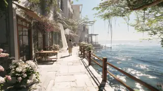
- **Prompt:** `CS · Causal Motion Trigger · In bright daylight, POET wanders from the new temple, moving towards a café located by the harbor · Photo-realistic, bright sunlight, clean architecture of the temple, sparkling harbor water, serene atmosphere, POET's relaxed stroll.`
- **In the cuts:**
  - suite: BR (shots from 2 films, no time between them: a category) · Park Conscious (1938); Ramp sleepboot 'De Schelde' te Hoek van Holland (1925)
  - scenes: SEQ (one film, moments skipped) · Zaandam (1921); Zaandam (1921)
  - cineosis: BR (shots from 2 films, no time between them: a category) · Wonderful World (Part III) (n.d.); [Amateur film: Medicus collection: New York Worl (1939)
  - drift: BR (shots from 2 films, no time between them: a category) · Wind: An Energy Alternative (1980); [Amateur film: Summers collection: San Francisco (1941)

### Syntagma 49 (SY49)
- **Type (intended):** Descriptive Syntagma (DS) [72–75] · on Metz's table: DESC
- **Purpose:** Subjective Frame Recalibration; Temporal Reflection Loop
- **Read in the cuts:** suite BR×4 · scenes SEQ×2, BR×2 · cineosis BR×4 · drift BR×4
- **Intended type realised:** 0% of shot-by-cut pairs

#### Shot 72 (SH72) · WGY072
- **Content:** At the café, POET observes various romantic couples at other tables.
- **Scene:** At café, POET observes romantic interests at other tables.
- **Angle:** —
- **Duration:** 17.4 s (21:00–21:17, beat 77 · Poet watches romantic couples · match 0.75)
- **Movement:** —
- **Function:** Subjective Frame Recalibration · Perception-Image
- **Her words:** “and molding a better world to return to / with every pulsing beat after walking alone. / I want you to really notice me / with the distances we couldn't avoid / and our younger selves watching and dreaming, / while our elders clutch their pearls, / hold their faith and breath closely,”
- **Image:** 
- **Prompt:** `PI · Subjective Frame Recalibration · At the café, POET observes various romantic couples at other tables · Photo-realistic, intimate café setting, soft natural light, bokeh on background couples, focus on POET's subtle expression of observation, perhaps a touch of longing or curiosity.`
- **In the cuts:**
  - suite: BR (shots from 3 films, no time between them: a category) · Ramp sleepboot 'De Schelde' te Hoek van Holland (1925); Family Life (1949); California Picture Book (1946)
  - scenes: SEQ (one film, source order unknown, with an insert) · Zaandam (1921); JFK EXHIBIT 3: RECONSTRUCTION FILM (1943); JFK EXHIBIT 3: RECONSTRUCTION FILM (1943)
  - cineosis: BR (shots from 3 films, no time between them: a category) · [Amateur film: Medicus collection: New York Worl (1939); Gateways to the Mind (1958); Moonwalk One, ca. 1970 (1970)
  - drift: BR (shots from 3 films, no time between them: a category) · [Amateur film: Summers collection: San Francisco (1941); Alice In Wonderland (1915); [Amateur film: Medicus collection: New York Worl (1939)

#### Shot 73 (SH73) · WGY073
- **Content:** POET observes an old couple praying together in a traditional church, a moment of quiet devotion.
- **Scene:** POET observes old couple praying together at church.
- **Angle:** —
- **Duration:** 17.4 s (21:46–22:04, beat 80 · Older couple prays in church · match 0.5)
- **Movement:** —
- **Function:** Subjective Frame Recalibration · Perception-Image
- **Her words:** “I've learned to love myself more, / manage loss and harvest a wizardry more brilliant / than the scarlet poppies and purple blossoms / at time and tears have just claimed. / Yet from a distant window, beautiful and calm,”
- **Image:** 
- **Prompt:** `PI · Subjective Frame Recalibration · POET observes an old couple praying together in a traditional church, a moment of quiet devotion · Photo-realistic, warm, muted church interior, soft lighting, focus on the couple's clasped hands or serene faces, sense of peace and enduring faith. (B-Roll Inspos: Old couple praying together at church).`
- **In the cuts:**
  - suite: BR (shots from 3 films, no time between them: a category) · California Picture Book (1946); Vertrek mr. B. Fock als gouverneur Nederlands-In (1921); Amateur Film Northwest (n.d.)
  - scenes: SEQ (one film, moments skipped, with an insert) · Gardening (1940); ALASKAN EARTHQUAKE (1966); ALASKAN EARTHQUAKE (1966)
  - cineosis: BR (shots from 3 films, no time between them: a category) · Your Town: A Story of America (1940); All My Babies (1953); [Amateur film: San Francisco] (1940)
  - drift: BR (shots from 3 films, no time between them: a category) · Garden Wise (Pt 1) (n.d.); Gift of Green (1946); Small Steps...Giant Strides (1973)

#### Shot 74 (SH74) · WGY074
- **Content:** Vast fields of flowers are harvested, their essence transforming into luminous energy that flows into POET, symbolizing inner power and regeneration.
- **Scene:** Fields of flowers harvested, becoming POET's power.
- **Angle:** —
- **Duration:** 8.7 s (22:04–22:12, beat 81 · Flowers harvested into Poet’s power · match 1.0)
- **Movement:** —
- **Function:** Temporal Reflection Loop · Crystal-Image
- **Her words:** “hope tells me you'll see me. / And if you notice me and capture my eyes / as you refocus yours, / stepping back and letting them say hello,”
- **Image:** 
- **Prompt:** `CI · Temporal Reflection Loop · Vast fields of flowers are harvested, their essence transforming into luminous energy that flows into POET, symbolizing inner power and regeneration · Photo-realistic, vibrant flower fields, time-lapse harvesting effects, glowing floral energy coalescing into POET's figure, ethereal and empowering visual, perhaps subtle colors shifting.`
- **In the cuts:**
  - suite: BR (shots from 2 films, no time between them: a category) · Amateur Film Northwest (n.d.); Gardening (1940)
  - scenes: BR (shots from 2 films, no time between them: a category) · ALASKAN EARTHQUAKE (1966); Opening tramlijn naar Wassenaar (1923)
  - cineosis: BR (shots from 2 films, no time between them: a category) · [Amateur film: San Francisco] (1940); Garden Wise (Pt 2) (n.d.)
  - drift: BR (shots from 2 films, no time between them: a category) · Small Steps...Giant Strides (1973); House of the woods: A forest trilogy (1983)

#### Shot 75 (SH75) · WGY075
- **Content:** POET is still at the café, continuing to observe the romantic couples from a distance.
- **Scene:** POET at café, still watching romantic couples.
- **Angle:** —
- **Duration:** 8.7 s (22:12–22:21, beat 81 · Flowers harvested into Poet’s power · match 0.25)
- **Movement:** —
- **Function:** Subjective Frame Recalibration · Perception-Image
- **Her words:** “stepping back and letting them say hello, / all the fatigue of wandering alone in thought, / in windless seasons and scarlet poppies”
- **Image:** 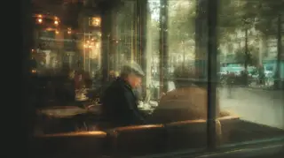
- **Prompt:** `PI · Subjective Frame Recalibration · POET is still at the café, continuing to observe the romantic couples from a distance · Photo-realistic, re-establishing the café scene, subtle changes in POET's posture or gaze, reinforcing the theme of observation and inner reflection.`
- **In the cuts:**
  - suite: BR (shots from 2 films, no time between them: a category) · Amateur Film Northwest (n.d.); Gardening (1940)
  - scenes: BR (shots from 2 films, no time between them: a category) · ALASKAN EARTHQUAKE (1966); Opening tramlijn naar Wassenaar (1923)
  - cineosis: BR (shots from 2 films, no time between them: a category) · [Amateur film: San Francisco] (1940); Garden Wise (Pt 2) (n.d.)
  - drift: BR (shots from 2 films, no time between them: a category) · Small Steps...Giant Strides (1973); House of the woods: A forest trilogy (1983)

### Syntagma 50 (SY50)
- **Type (intended):** Chronological Syntagma (CS) [76] · on Metz's table: chronological (SC · SEQ · EP · ALT)
- **Purpose:** Causal Motion Trigger
- **Read in the cuts:** suite AS · scenes AS · cineosis AS · drift AS
- **Intended type realised:** 0% of shot-by-cut pairs

#### Shot 76 (SH76) · WGY076
- **Content:** POET rises from the café table and begins walking along the harbor.
- **Scene:** POET stands to leave café, walks around harbor.
- **Angle:** —
- **Duration:** 11.6 s (22:21–22:32, beat 82 · Poet rises from cafe, walks alone · match 0.6)
- **Movement:** —
- **Function:** Causal Motion Trigger · Action-Image
- **Her words:** “in windless seasons and scarlet poppies / won't prevent me from sharing a smile / worth the promise of my heart.”
- **Image:** 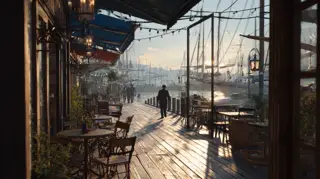
- **Prompt:** `CS · Causal Motion Trigger · POET rises from the café table and begins walking along the harbor · Photo-realistic, smooth motion, transition from interior to exterior, vibrant harbor scene, sense of forward movement and exploration.`
- **In the cuts:**
  - suite: AS (one shot holds the whole slot) · All My Babies (1953)
  - scenes: AS (one shot holds the whole slot) · Opening tramlijn naar Wassenaar (1923)
  - cineosis: AS (one shot holds the whole slot) · Dial Comes To Town (n.d.)
  - drift: AS (one shot holds the whole slot) · Mobile Lab : Any Questions? (1974)

### Syntagma 51 (SY51)
- **Type (intended):** Descriptive Syntagma (DS) [77–78] · on Metz's table: DESC
- **Purpose:** Mood Environment Stabilizer; Temporal Reflection Loop
- **Read in the cuts:** suite BR×2 · scenes SC×2 · cineosis BR×2 · drift BR×2
- **Intended type realised:** 0% of shot-by-cut pairs

#### Shot 77 (SH77) · WGY077
- **Content:** A dense haze begins to gather on the water and over the harbor, steadily growing and obscuring the view.
- **Scene:** Haze gathers on water, over harbor, and grows.
- **Angle:** —
- **Duration:** 7.3 s (22:32–22:40, beat 83 · Harbor, temple, Atlantis dissolve into haze · match 0.4)
- **Movement:** —
- **Function:** Mood Environment Stabilizer · Descriptive Image
- **Her words:** “Don't make me leave and go where promises, hearts,”
- **Image:** 
- **Prompt:** `DS · Mood Environment Stabilizer · A dense haze begins to gather on the water and over the harbor, steadily growing and obscuring the view · Photo-realistic, atmospheric, increasing fog/haze effect, soft light diffusion, muted colors, sense of impending change and mystery.`
- **In the cuts:**
  - suite: BR (shots from 2 films, no time between them: a category) · Muller en co n.v. Rotterdam (1928); DEMOCRACY IN EDUCATION, ca. 1919 (n.d.)
  - scenes: SC (one film, no time skipped) · Muller en co n.v. Rotterdam (1928); Muller en co n.v. Rotterdam (1928)
  - cineosis: BR (shots from 2 films, no time between them: a category) · Steenkolen Handels Vereeniging (1923); DEMOCRACY IN EDUCATION, ca. 1919 (n.d.)
  - drift: BR (shots from 2 films, no time between them: a category) · Friendship Seven (1962); SPACE AGE RAILROAD (1969)

#### Shot 78 (SH78) · WGY078
- **Content:** Atlantis, the newly built temple, and the entire harbor gradually dissolve into an enveloping haze.
- **Scene:** Atlantis, new temple, harbor slowly become haze.
- **Angle:** —
- **Duration:** 7.3 s (22:40–22:47, beat 83 · Harbor, temple, Atlantis dissolve into haze · match 1.0)
- **Movement:** —
- **Function:** Temporal Reflection Loop · Crystal-Image
- **Her words:** “Don't make me leave and go where promises, hearts, / spectrums of light-filled constellations are broken. / I escaped here for a reason,”
- **Image:** 
- **Prompt:** `CI · Temporal Reflection Loop · Atlantis, the newly built temple, and the entire harbor gradually dissolve into an enveloping haze · Photo-realistic, surreal, slow-motion dissolution effect, iconic structures fading into monochromatic haze, emphasizing impermanence and dreamlike quality.`
- **In the cuts:**
  - suite: BR (shots from 2 films, no time between them: a category) · Muller en co n.v. Rotterdam (1928); DEMOCRACY IN EDUCATION, ca. 1919 (n.d.)
  - scenes: SC (one film, no time skipped) · Muller en co n.v. Rotterdam (1928); Muller en co n.v. Rotterdam (1928)
  - cineosis: BR (shots from 2 films, no time between them: a category) · Steenkolen Handels Vereeniging (1923); DEMOCRACY IN EDUCATION, ca. 1919 (n.d.)
  - drift: BR (shots from 2 films, no time between them: a category) · Friendship Seven (1962); SPACE AGE RAILROAD (1969)

### Syntagma 52 (SY52)
- **Type (intended):** Autonomous Syntagma (AS) [79] · on Metz's table: AS
- **Purpose:** Emotion Relay
- **Read in the cuts:** suite BR · scenes BR · cineosis BR · drift BR
- **Intended type realised:** 0% of shot-by-cut pairs

#### Shot 79 (SH79) · WGY079
- **Content:** The haze slowly envelops POET's body from the ground upward, with POET showing initial reluctance before acceptance.
- **Scene:** Haze slowly envelops POET, who is reluctant.
- **Angle:** —
- **Duration:** 7.3 s (22:47–22:54, beat 84 · Haze climbs reluctant Poet; float in black · match 0.5)
- **Movement:** slowly
- **Function:** Emotion Relay · Affection-Image
- **Her words:** “believing this would give me a sharpened key of answers / in a more grounded bravado / for my life of conquests and queries.”
- **Image:** 
- **Prompt:** `AF · Emotion Relay · The haze slowly envelops POET's body from the ground upward, with POET showing initial reluctance before acceptance · Photo-realistic, emotional, slow and gradual engulfment, POET's subtle expressions of hesitation transitioning to calm, soft, glowing haze, surreal atmosphere.`
- **In the cuts:**
  - suite: BR (shots from 2 films, no time between them: a category) · DEMOCRACY IN EDUCATION, ca. 1919 (n.d.); Vertrek mr. B. Fock als gouverneur Nederlands-In (1921)
  - scenes: BR (shots from 2 films, no time between them: a category) · Muller en co n.v. Rotterdam (1928); Master Hands (n.d.)
  - cineosis: BR (shots from 2 films, no time between them: a category) · DEMOCRACY IN EDUCATION, ca. 1919 (n.d.); Out West (1918)
  - drift: BR (shots from 2 films, no time between them: a category) · SPACE AGE RAILROAD (1969); Eagle Has Landed: The Flight of Apollo 11 (1969)

### Syntagma 53 (SY53)
- **Type (intended):** Descriptive Syntagma (DS) [80] · on Metz's table: DESC
- **Purpose:** Temporal Reflection Loop
- **Read in the cuts:** suite BR · scenes BR · cineosis BR · drift BR
- **Intended type realised:** 0% of shot-by-cut pairs

#### Shot 80 (SH80) · WGY080
- **Content:** POET is once again suspended and floating in an expanse of pure blackness.
- **Scene:** POET is floating again in all black.
- **Angle:** —
- **Duration:** 7.3 s (22:54–23:02, beat 84 · Haze climbs reluctant Poet; float in black · match 0.33)
- **Movement:** pan, floating
- **Function:** Temporal Reflection Loop · Crystal-Image
- **Her words:** “for my life of conquests and queries. / The way you see things felt safe and timeless. / Whatever has terminated this moment, damn you,”
- **Image:** 
- **Prompt:** `CI · Temporal Reflection Loop · POET is once again suspended and floating in an expanse of pure blackness · Photo-realistic, abstract black void, solitary figure, sense of suspension, minimalist, deep silence, cyclical return to this state.`
- **In the cuts:**
  - suite: BR (shots from 2 films, no time between them: a category) · DEMOCRACY IN EDUCATION, ca. 1919 (n.d.); Vertrek mr. B. Fock als gouverneur Nederlands-In (1921)
  - scenes: BR (shots from 2 films, no time between them: a category) · Muller en co n.v. Rotterdam (1928); Master Hands (n.d.)
  - cineosis: BR (shots from 2 films, no time between them: a category) · DEMOCRACY IN EDUCATION, ca. 1919 (n.d.); Out West (1918)
  - drift: BR (shots from 2 films, no time between them: a category) · SPACE AGE RAILROAD (1969); Eagle Has Landed: The Flight of Apollo 11 (1969)

### Syntagma 54 (SY54)
- **Type (intended):** Thematic Montage (TM) [81–83] · on Metz's table: achronological (PAR · BR)
- **Purpose:** Narrative Modifier
- **Read in the cuts:** suite BR×3 · scenes SEQ×3 · cineosis BR×3 · drift BR×3
- **Intended type realised:** 75% of shot-by-cut pairs

#### Shot 81 (SH81) · WGY081
- **Content:** Rapid cuts intersperse POET floating in blackness with various B-roll scenes of life, capturing the highs and lows.
- **Scene:** Cut back and forth from POET floating to B-Roll scenes of life.
- **Angle:** —
- **Duration:** 6.5 s (23:02–23:08, beat 85 · Floating alternates with life’s highs and lows · match 0.8)
- **Movement:** dynamic, floating
- **Function:** Narrative Modifier · Thematic Montage
- **Her words:** “Whatever has terminated this moment, damn you, / but let it feel love and lost as we must endure,”
- **Image:** 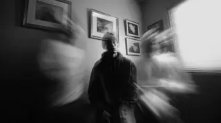
- **Prompt:** `TM · Narrative Modifier · Rapid cuts intersperse POET floating in blackness with various B-roll scenes of life, capturing the highs and lows · Photo-realistic, rapid alternating cuts, stark contrast between void and vibrant life, dynamic editing, quick flashes of human connection, struggle, and joy.`
- **In the cuts:**
  - suite: BR (shots from 3 films, no time between them: a category) · Master Hands (n.d.); Let's Go To The Movies (1948); Care of the Hair and Nails (1951)
  - scenes: SEQ (one film, source order unknown, with an insert) · Space Ship Takeoff, a Technical Fantasy (1937); Sound And The Story (1956); Sound And The Story (1956)
  - cineosis: BR (shots from 3 films, no time between them: a category) · Duck and Cover (1951); Master Hands (n.d.); Plastics (1944)
  - drift: BR (shots from 3 films, no time between them: a category) · 1959 RCA 21-inch TV Screen (1959); Hillsborough with New Hideaway Styling, The (1959); RCA 16mm Sound Projector, The (1958)

#### Shot 82 (SH82) · WGY082
- **Content:** The B-roll scenes vividly capture the diverse highs and lows of human life.
- **Scene:** Human scenes capturing the highs and lows of life.
- **Angle:** —
- **Duration:** 6.5 s (23:08–23:14, beat 85 · Floating alternates with life’s highs and lows · match 0.6)
- **Movement:** —
- **Function:** Narrative Modifier · Thematic Montage
- **Her words:** “but let it feel love and lost as we must endure, / absent artificial escapes and machine learning strengths / for my highs and lows as resource materials.”
- **Image:** 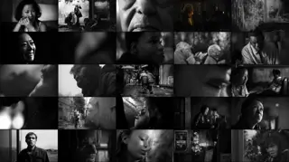
- **Prompt:** `TM · Narrative Modifier · The B-roll scenes vividly capture the diverse highs and lows of human life · Photo-realistic, montage of intimate vignettes: joyous laughter, quiet despair, moments of struggle, triumph, tender family moments, global events. High contrast, raw emotion, diverse human experience.`
- **In the cuts:**
  - suite: BR (shots from 3 films, no time between them: a category) · Master Hands (n.d.); Let's Go To The Movies (1948); Care of the Hair and Nails (1951)
  - scenes: SEQ (one film, source order unknown, with an insert) · Space Ship Takeoff, a Technical Fantasy (1937); Sound And The Story (1956); Sound And The Story (1956)
  - cineosis: BR (shots from 3 films, no time between them: a category) · Duck and Cover (1951); Master Hands (n.d.); Plastics (1944)
  - drift: BR (shots from 3 films, no time between them: a category) · 1959 RCA 21-inch TV Screen (1959); Hillsborough with New Hideaway Styling, The (1959); RCA 16mm Sound Projector, The (1958)

#### Shot 83 (SH83) · WGY083
- **Content:** The alternating cuts between POET floating in blackness and human life scenes continue, emphasizing their cyclical relationship.
- **Scene:** Cut back and forth from POET floating in blackness.
- **Angle:** —
- **Duration:** 6.5 s (23:14–23:21, beat 85 · Floating alternates with life’s highs and lows · match 0.4)
- **Movement:** floating
- **Function:** Narrative Modifier · Thematic Montage
- **Her words:** “for my highs and lows as resource materials. / Well, I can't leave behind the impulse / that comes from battle scars”
- **Image:** 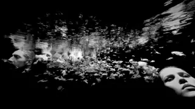
- **Prompt:** `TM · Narrative Modifier · The alternating cuts between POET floating in blackness and human life scenes continue, emphasizing their cyclical relationship · Photo-realistic, repetitive pattern of cuts, stark contrast between void and vibrant human experience, reinforcing the theme of connection and isolation.`
- **In the cuts:**
  - suite: BR (shots from 3 films, no time between them: a category) · Master Hands (n.d.); Let's Go To The Movies (1948); Care of the Hair and Nails (1951)
  - scenes: SEQ (one film, source order unknown, with an insert) · Space Ship Takeoff, a Technical Fantasy (1937); Sound And The Story (1956); Sound And The Story (1956)
  - cineosis: BR (shots from 3 films, no time between them: a category) · Duck and Cover (1951); Master Hands (n.d.); Plastics (1944)
  - drift: BR (shots from 3 films, no time between them: a category) · 1959 RCA 21-inch TV Screen (1959); Hillsborough with New Hideaway Styling, The (1959); RCA 16mm Sound Projector, The (1958)

### Syntagma 55 (SY55)
- **Type (intended):** Descriptive Syntagma (DS) [84–85] · on Metz's table: DESC
- **Purpose:** Mood Environment Stabilizer; Temporal Reflection Loop
- **Read in the cuts:** suite BR×2 · scenes BR×2 · cineosis BR×2 · drift BR×2
- **Intended type realised:** 0% of shot-by-cut pairs

#### Shot 84 (SH84) · WGY084
- **Content:** POET remains suspended in the vast, all-encompassing black void, a moment of profound stillness before transition.
- **Scene:** POET still floating in all black.
- **Angle:** —
- **Duration:** 4.8 s (23:21–23:26, beat 86 · Vintage door appears in black · match 0.25)
- **Movement:** —
- **Function:** Mood Environment Stabilizer · Descriptive Image
- **Her words:** “that comes from battle scars / and can't leave behind the wisdom that brushes gray tones / into our melanin after disappointments and defeats.”
- **Image:** 
- **Prompt:** `DS · Mood Environment Stabilizer · POET remains suspended in the vast, all-encompassing black void, a moment of profound stillness before transition · Photo-realistic, pure black background, solitary figure, deep silence, minimalist, contemplative atmosphere.`
- **In the cuts:**
  - suite: BR (shots from 2 films, no time between them: a category) · Care of the Hair and Nails (1951); Meet Your Federal Government (1946)
  - scenes: BR (shots from 2 films, no time between them: a category) · Sound And The Story (1956); Eagle Has Landed: The Flight of Apollo 11 (1969)
  - cineosis: BR (shots from 2 films, no time between them: a category) · Plastics (1944); World of Tomorrow, The (Part II) (n.d.)
  - drift: BR (shots from 2 films, no time between them: a category) · RCA 16mm Sound Projector, The (1958); Safety: Harm Hides at Home (n.d.)

#### Shot 85 (SH85) · WGY085
- **Content:** An old, vintage wooden door materializes in the black space, appearing as a portal to another time or state.
- **Scene:** Old vintage door appears.
- **Angle:** —
- **Duration:** 4.8 s (23:26–23:31, beat 86 · Vintage door appears in black · match 1.0)
- **Movement:** —
- **Function:** Temporal Reflection Loop · Crystal-Image
- **Her words:** “into our melanin after disappointments and defeats. / I trust that you'll be fine.”
- **Image:** 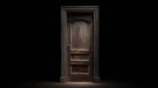
- **Prompt:** `CI · Temporal Reflection Loop · An old, vintage wooden door materializes in the black space, appearing as a portal to another time or state · Photo-realistic, surreal, antique wooden door, perhaps glowing softly at the edges, contrasting with the black void, inviting or mysterious, suggesting a cyclical return.`
- **In the cuts:**
  - suite: BR (shots from 2 films, no time between them: a category) · Care of the Hair and Nails (1951); Meet Your Federal Government (1946)
  - scenes: BR (shots from 2 films, no time between them: a category) · Sound And The Story (1956); Eagle Has Landed: The Flight of Apollo 11 (1969)
  - cineosis: BR (shots from 2 films, no time between them: a category) · Plastics (1944); World of Tomorrow, The (Part II) (n.d.)
  - drift: BR (shots from 2 films, no time between them: a category) · RCA 16mm Sound Projector, The (1958); Safety: Harm Hides at Home (n.d.)

### Syntagma 56 (SY56)
- **Type (intended):** Chronological Syntagma (CS) [86–87] · on Metz's table: chronological (SC · SEQ · EP · ALT)
- **Purpose:** Causal Motion Trigger
- **Read in the cuts:** suite BR×2 · scenes SEQ×2 · cineosis BR×2 · drift BR×2
- **Intended type realised:** 25% of shot-by-cut pairs

#### Shot 86 (SH86) · WGY086
- **Content:** POET steps through the door and re-enters the old-time vintage party, where guests are once again moving in romantic slow-motion.
- **Scene:** POET enters through door into old-time vintage party, guests in romantic slow-motion.
- **Angle:** —
- **Duration:** 14.5 s (23:31–23:45, beat 87 · Return to vintage party in slow motion · match 0.8)
- **Movement:** —
- **Function:** Causal Motion Trigger · Action-Image
- **Her words:** “I trust that you'll be fine. / I escaped here for a reason. / Our dance together is a victory to entwine muses, / immersed in twisted dons for a hot minute, / and a genesis of a New Testament as it ends.”
- **Image:** 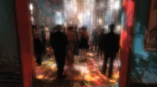
- **Prompt:** `CS · Causal Motion Trigger · POET steps through the door and re-enters the old-time vintage party, where guests are once again moving in romantic slow-motion · Photo-realistic, cyclical, seamless transition from blackness to warm, nostalgic party, re-establishing the romantic slow-motion and euphoric light from earlier, a sense of returning to a familiar, dreamlike state.`
- **In the cuts:**
  - suite: BR (shots from 3 films, no time between them: a category) · Meet Your Federal Government (1946); Kinderen naar buiten (1935); Under Western Stars (n.d.)
  - scenes: SEQ (one film, moments skipped, with an insert) · Eagle Has Landed: The Flight of Apollo 11 (1969); JFK EXHIBIT 3: RECONSTRUCTION FILM (1943); JFK EXHIBIT 3: RECONSTRUCTION FILM (1943)
  - cineosis: BR (shots from 3 films, no time between them: a category) · World of Tomorrow, The (Part II) (n.d.); All-American Soap Box Derby, The (1936) (1936); Brooklyn Goes to San Francisco (1947)
  - drift: BR (shots from 3 films, no time between them: a category) · Safety: Harm Hides at Home (n.d.); Spider Engineers (1956); Adelante Cubanos (Part II) (1959)

#### Shot 87 (SH87) · WGY087
- **Content:** POET's figure subtly blends and disappears into the back of the slow-moving party crowd, becoming indistinguishable.
- **Scene:** POET disappears into crowd from back.
- **Angle:** —
- **Duration:** 7.3 s (23:45–23:52, beat 88 · Poet disappears into crowd; door closes · match 0.6)
- **Movement:** —
- **Function:** Causal Motion Trigger · Action-Image
- **Her words:** “and a genesis of a New Testament as it ends.”
- **Image:** 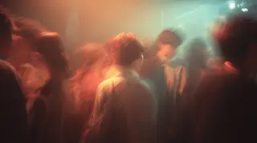
- **Prompt:** `CS · Causal Motion Trigger · POET's figure subtly blends and disappears into the back of the slow-moving party crowd, becoming indistinguishable · Photo-realistic, a gentle fade or merge effect, POET becomes one with the nostalgic scene, sense of conclusion and integration into the environment.`
- **In the cuts:**
  - suite: BR (shots from 3 films, no time between them: a category) · Under Western Stars (n.d.); Door to Heaven, The (1941); Stemmen verkiezingen (1922)
  - scenes: SEQ (one film, moments skipped, with an insert) · JFK EXHIBIT 3: RECONSTRUCTION FILM (1943); All My Babies (1953); All My Babies (1953)
  - cineosis: BR (shots from 3 films, no time between them: a category) · Brooklyn Goes to San Francisco (1947); Back-Room Boy (1942); Under Western Stars (n.d.)
  - drift: BR (shots from 3 films, no time between them: a category) · Adelante Cubanos (Part II) (1959); Friendship Seven (1962); Living Stereo (1958)

## Final Image

**Purpose:** The opposite of the Opening Image: proof of change. Here: SH88–SH88, 23:52–24:00, HOT MINUTE.

### Syntagma 57 (SY57)
- **Type (intended):** Descriptive Syntagma (DS) [88] · on Metz's table: DESC
- **Purpose:** Mood Environment Stabilizer
- **Read in the cuts:** suite BR · scenes SEQ · cineosis BR · drift BR
- **Intended type realised:** 0% of shot-by-cut pairs

#### Shot 88 (SH88) · WGY088
- **Content:** The vintage door slowly closes, leaving the viewer outside the scene.
- **Scene:** Door closes.
- **Angle:** —
- **Duration:** 7.3 s (23:52–24:00, beat 88 · Poet disappears into crowd; door closes · match 0.4)
- **Movement:** slowly
- **Function:** Mood Environment Stabilizer · Descriptive Image
- **Her words:** — (instrumental)
- **Image:** 
- **Prompt:** `DS · Mood Environment Stabilizer · The vintage door slowly closes, leaving the viewer outside the scene · Photo-realistic, sense of finality, slow closure of the ornate door, perhaps a soft click, emphasizing the end of the narrative, simple and conclusive.`
- **In the cuts:**
  - suite: BR (shots from 3 films, no time between them: a category) · Under Western Stars (n.d.); Door to Heaven, The (1941); Stemmen verkiezingen (1922)
  - scenes: SEQ (one film, moments skipped, with an insert) · JFK EXHIBIT 3: RECONSTRUCTION FILM (1943); All My Babies (1953); All My Babies (1953)
  - cineosis: BR (shots from 3 films, no time between them: a category) · Brooklyn Goes to San Francisco (1947); Back-Room Boy (1942); Under Western Stars (n.d.)
  - drift: BR (shots from 3 films, no time between them: a category) · Adelante Cubanos (Part II) (1959); Friendship Seven (1962); Living Stereo (1958)
